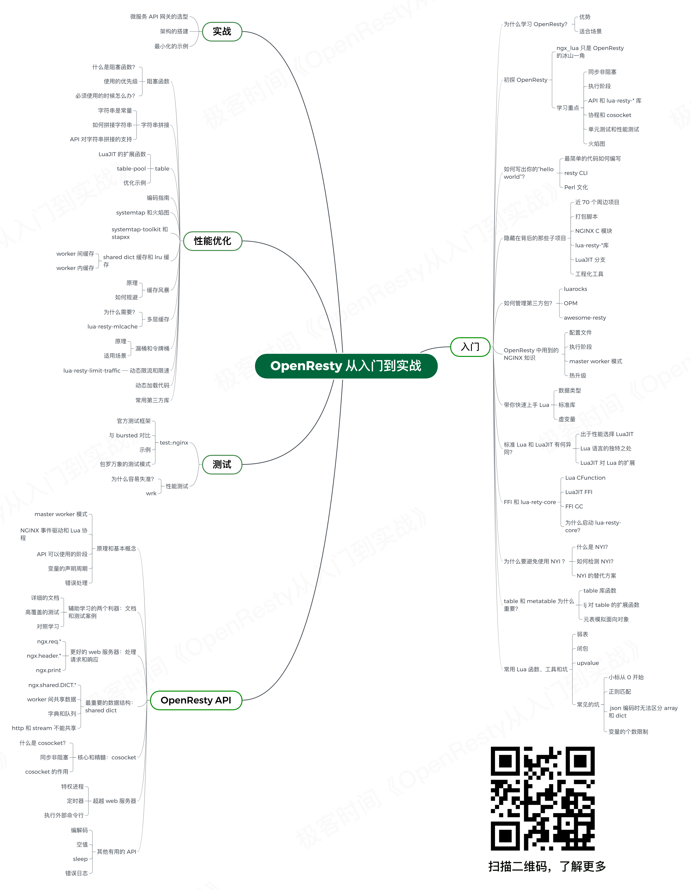

OpenResty 最佳实践
=======

[在 gitbook 上查看本书](https://yousali.me/openresty-best-practices/)

## Openresty 专业培训

我们提供 OpenResty、Apache APISIX 以及 API 网关方面相关的咨询、培训、性能优化、定制开发等商业支持服务，欢迎联系。
微信：ming69371, 邮箱：wenming@apache.org

## 如何贡献？

本书源码在 GitHub 上维护，欢迎参与：[我要写书](https://github.com/moonbingbing/openresty-best-practices)。也可以加入 QQ 群来和我们交流：

- 34782325（技术交流 ①群 已满）
- 481213820（技术交流 ②群 已满）
- 124613000（技术交流 ③群 已满）
- 679145170（技术交流 ④群）

当前维护者：yousali

联系方式：

- 微信 `y0usali`
- 邮箱 `yousa@apache.org`
- (从来不查邮箱，请通过微信联系)

**作者极客时间专栏：[《OpenResty 从入门到实战》](http://gk.link/a/103tv)**

