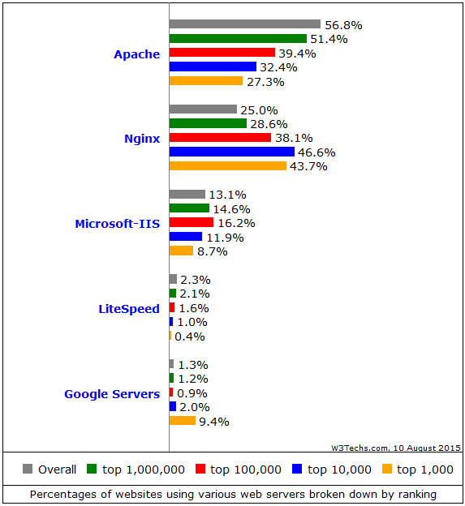

# Socket 编程发展

Linux Socket 编程领域，为了处理大量连接请求场景，需要使用非阻塞 I/O 和复用。select、poll 和 epoll 是 Linux API 提供的 I/O 复用方式，自从 Linux 2.6 中加入了 epoll 之后，高性能服务器领域得到广泛的应用，现在比较出名的 Nginx 就是使用 epoll 来实现 I/O 复用支持高并发，目前在高并发的场景下，Nginx 越来越收到欢迎。

据 w3techs 在2015年8月10日的统计数据表明，在全球 Top 1000 的网站中，有 43.7% 的网站在使用 Nginx，这使得 Nginx 超越了 Apache，成为了高流量网站最信任的 Web 服务器足足有两年时间。已经确定在使用Nginx的站点有：Wikipedia，WordPress，Reddit，Tumblr，Pinterest，Dropbox，Slideshare，Stackexchange 等，可以持续罗列好几个小时，他们太多了。

下图是统计数据：



#### select 模型

下面是 select 函数接口：

```c
int select (int n, fd_set *readfds, fd_set *writefds,
        fd_set *exceptfds, struct timeval *timeout);
```

select 函数监视的文件描述符分 3 类，分别是 writefds、readfds和 exceptfds。调用后 select 函数会阻塞，直到有描述符就绪（有数据 可读、可写、或者有except），或者超时（timeout 指定等待时间，如果立即返回设为 null 即可）。当 select 函数返回后，通过遍历 fd_set，来找到就绪的描述符。

select 目前几乎在所有的平台上支持，其良好跨平台支持是它的一大优点。select 的一个缺点在于单个进程能够监视的文件描述符的数量存在最大限制，在 Linux 上一般为1024，可以通过修改宏定义甚至重新编译内核的方式提升这一限制，但是这样也会造成效率的降低。

#### poll 模型

```c
int poll (struct pollfd *fds, unsigned int nfds, int timeout);
```

不同与select使用三个位图来表示三个fdset的方式，poll 使用一个 pollfd 的指针实现。

```c
struct pollfd {
    int fd; /* file descriptor */
    short events; /* requested events to watch */
    short revents; /* returned events witnessed */
};
```

pollfd 结构包含了要监视的 event 和发生的 event，不再使用 select “参数-值”传递的方式。同时，pollfd 并没有最大数量限制（但是数量过大后性能也是会下降）。 和 select 函数一样，poll 返回后，需要轮询 pollfd 来获取就绪的描述符。

从上面看，select 和 poll 都需要在返回后，通过遍历文件描述符来获取已经就绪的 socket。事实上，同时连接的大量客户端在一时刻可能只有很少的处于就绪状态，因此随着监视的描述符数量的增长，其效率也会线性下降。

#### epoll 模型

epoll 的接口如下：

``` c
int epoll_create(int size)；
int epoll_ctl(int epfd, int op, int fd, struct epoll_event *event)；
            typedef union epoll_data {
                void *ptr;
                int fd;
                __uint32_t u32;
                __uint64_t u64;
            } epoll_data_t;

            struct epoll_event {
                __uint32_t events;      /* Epoll events */
                epoll_data_t data;      /* User data variable */
            };

int epoll_wait(int epfd, struct epoll_event * events,
                int maxevents, int timeout);
```

主要是 epoll_create，epoll_ctl 和 epoll_wait 三个函数。epoll_create 函数创建 epoll 文件描述符，参数 size 并不是限制了 epoll 所能监听的描述符最大个数，只是对内核初始分配内部数据结构的一个建议。epoll_ctl 完成对指定描述符 fd 执行 op 操作控制，event 是与 fd 关联的监听事件。op 操作有三种：添加 EPOLL_CTL_ADD，删除 EPOLL_CTL_DEL，修改 EPOLL_CTL_MOD。分别添加、删除和修改对 fd 的监听事件。epoll_wait 等待 epfd 上的 IO 事件，最多返回 maxevents 个事件。

在 select/poll 中，进程只有在调用一定的方法后，内核才对所有监视的文件描述符进行扫描，而 epoll 事先通过 epoll_ctl() 来注册一个文件描述符，一旦基于某个文件描述符就绪时，内核会采用类似 callback 的回调机制，迅速激活这个文件描述符，当进程调用 epoll_wait 时便得到通知。

epoll 的优点主要是一下几个方面：

1. 监视的描述符数量不受限制，它所支持的 fd 上限是最大可以打开文件的数目，这个数字一般远大于 2048,举个例子,在 1GB 内存的机器上大约是 10 万左右，具体数目可以 cat /proc/sys/fs/file-max 察看,一般来说这个数目和系统内存关系很大。select 的最大缺点就是进程打开的 fd 是有数量限制的。这对于连接数量比较大的服务器来说根本不能满足。虽然也可以选择多进程的解决方案( Apache 就是这样实现的)，不过虽然 linux 上面创建进程的代价比较小，但仍旧是不可忽视的，加上进程间数据同步远比不上线程间同步的高效，所以也不是一种完美的方案。
2. IO 的效率不会随着监视 fd 的数量的增长而下降。epoll 不同于 select 和 poll 轮询的方式，而是通过每个 fd 定义的回调函数来实现的。只有就绪的 fd 才会执行回调函数。
3. 支持水平触发和边沿触发两种模式：
    * 水平触发模式，文件描述符状态发生变化后，如果没有采取行动，它将后面反复通知，这种情况下编程相对简单，libevent 等开源库很多都是使用的这种模式。
    * 边沿触发模式，只告诉进程哪些文件描述符刚刚变为就绪状态，只说一遍，如果没有采取行动，那么它将不会再次告知。理论上边缘触发的性能要更高一些，但是代码实现相当复杂（Nginx 使用的边缘触发）。
4. mmap 加速内核与用户空间的信息传递。epoll 是通过内核与用户空间 mmap 同一块内存，避免了无谓的内存拷贝。
