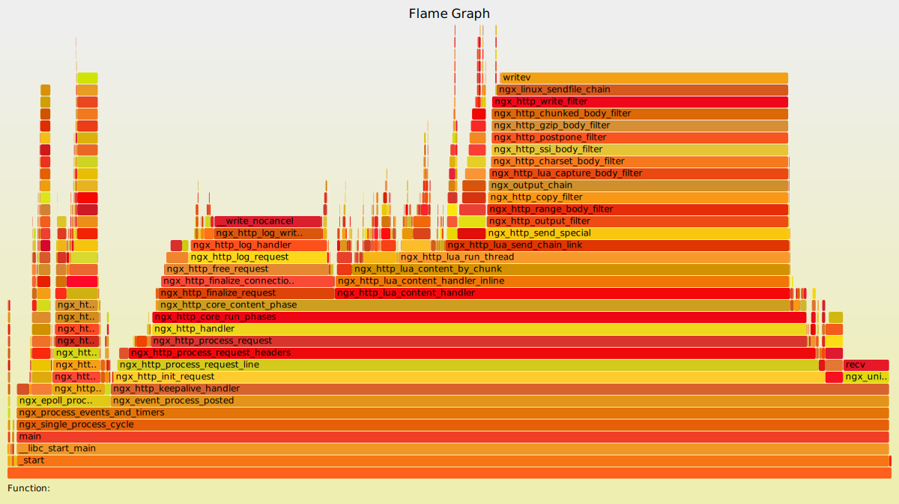
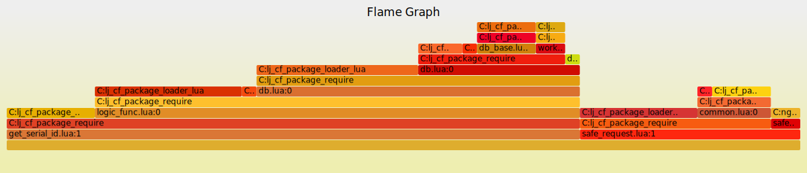

# 如何定位问题

一个正常的火焰图，应该呈现出如[官网](http://openresty.org/download/user-flamegraph.svg)给出的样例（官网的火焰图是抓 C 级别函数）：


从上图可以看出，正常业务下的火焰图形状类似的“山脉”，“山脉”的“海拔”表示 worker 中业务函数的调用深度，“山脉”的“长度”表示 worker 中业务函数占用 cpu 的比例。

下面将用一个实际应用中遇到问题抽象出来的示例（CPU 占用过高）来说明如何通过火焰图定位问题。

问题表现，Nginx worker 运行一段时间后出现 CPU 占用 100% 的情况，reload 后一段时间后复现，当出现 CPU 占用率高情况的时候是某个 worker 占用率高。

问题分析，单 worker cpu 高的情况一定是某个 input 中包含的信息不能被 Lua 函数以正确地方式处理导致的，因此上火焰图找出具体的函数，抓取的过程需要抓取 C 级别的函数和 Lua 级别的函数，抓取相同的时间，两张图一起分析才能得到准确的结果。

抓取步骤：

* [安装SystemTap](install.md)
* 获取 CPU 异常的 worker 的进程 ID ：
> ps -ef | grep nginx

* 使用 [lj-lua-stacks.sxx](https://github.com/openresty/stapxx#lj-lua-stacks) 抓取栈信息，并用 [fix-lua-bt](https://github.com/openresty/openresty-systemtap-toolkit#fix-lua-bt) 工具处理：
```
# making the ./stap++ tool visible in PATH:
$ export PATH=$PWD:$PATH
# assuming the nginx worker process pid is 6949:
$ ./samples/lj-lua-stacks.sxx --arg time=5 --skip-badvars -x 6949 > tmp.bt
Start tracing 6949 (/opt/nginx/sbin/nginx)
Please wait for 5 seconds
$ ./fix-lua-bt tmp.bt > a.bt
```

* 使用 [stackcollapse-stap.pl 和 flamegraph.pl](https://github.com/brendangregg/FlameGraph)：
> ./stackcollapse-stap.pl a.bt > a.cbt
> ./flamegraph.pl a.cbt > a.svg

* a.svg 即是火焰图，拖入浏览器即可：


* 从上图可以清楚的看到 get_serial_id 这个函数占用了绝大部分的 CPU 比例，问题的排查可以从这里入手，找到其调用栈中异常的函数。


PS：一般来说一个正常的火焰图看起来像一座座连绵起伏的“山峰”，而一个异常的火焰图看起来像一座“平顶山”。
