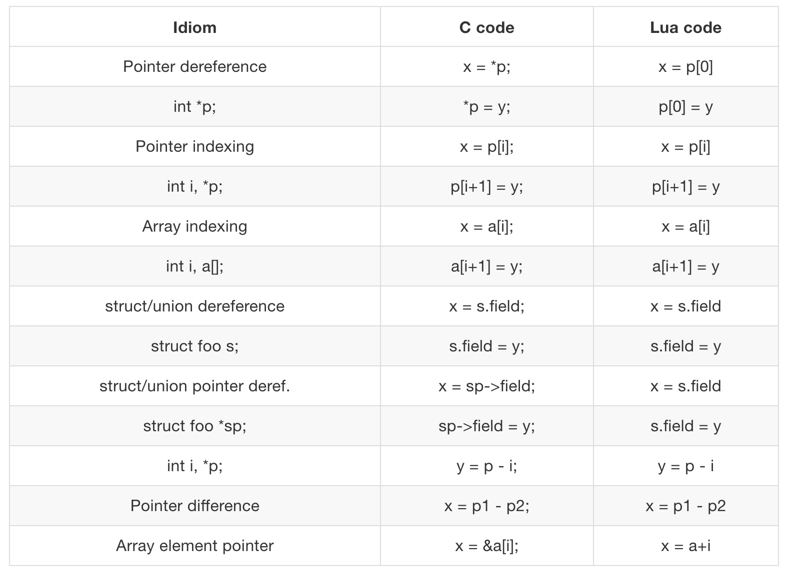

# FFI

FFI 库，是 LuaJIT 中最重要的一个扩展库。它允许从纯 Lua 代码调用外部C函数，使用 C 数据结构。有了它，就不用再像 Lua 标准 math 库一样，编写 Lua 扩展库。把开发者从开发 Lua 扩展 C 库（语言/功能绑定库）的繁重工作中释放出来。

FFI 库最大限度的省去了使用 C 手工编写繁重的 Lua/C 绑定的需要。不需要学习一门独立/额外的绑定语言——它解析普通 C 声明。这样可以从 C 头文件或参考手册中，直接剪切，粘贴。它的任务就是绑定很大的库，但不需要捣鼓脆弱的绑定生成器。

FFI 紧紧的整合进了 LuaJIT（几乎不可能作为一个独立的模块）。JIT 编译器为 Lua 代码直接访问 C 数据结构而产生的代码，等同于一个 C 编译器应该生产的代码。在 JIT 编译过的代码中，调用 C 函数，可以被内连处理，不同于基于 Lua/C API 函数调用。

#### 调用 C 函数

真的很用容易去调用一个外部C库函数，示例代码：

```lua
local ffi = require("ffi")
ffi.cdef[[
int printf(const char *fmt, ...);
]]
ffi.C.printf("Hello %s!", "world")
```

以上操作步骤，如下：

1. 加载FFI库
1. 为函数增加一个函数声明。这个包含在`中括号`对之间的部分，是标准C语法。.
1. 调用命名的C函数——非常简单

事实上，背后的实现远非如此简单：③ 使用标准C库的命名空间 ffi.C。通过符号名 ("printf") 索引这个命名空间，自动绑定标准 C 库。索引结果是一个特殊类型的对象，当被调用时，执行 printf 函数。传递给这个函数的参数，从 Lua 对象自动转换为相应的 C 类型。

再来一个源自官方的示例代码：

```lua
local ffi = require("ffi")
ffi.cdef[[
unsigned long compressBound(unsigned long sourceLen);
int compress2(uint8_t *dest, unsigned long *destLen,
        const uint8_t *source, unsigned long sourceLen, int level);
int uncompress(uint8_t *dest, unsigned long *destLen,
         const uint8_t *source, unsigned long sourceLen);
]]
local zlib = ffi.load(ffi.os == "Windows" and "zlib1" or "z")

local function compress(txt)
  local n = zlib.compressBound(#txt)
  local buf = ffi.new("uint8_t[?]", n)
  local buflen = ffi.new("unsigned long[1]", n)
  local res = zlib.compress2(buf, buflen, txt, #txt, 9)
  assert(res == 0)
  return ffi.string(buf, buflen[0])
end

local function uncompress(comp, n)
  local buf = ffi.new("uint8_t[?]", n)
  local buflen = ffi.new("unsigned long[1]", n)
  local res = zlib.uncompress(buf, buflen, comp, #comp)
  assert(res == 0)
  return ffi.string(buf, buflen[0])
end

-- Simple test code.
local txt = string.rep("abcd", 1000)
print("Uncompressed size: ", #txt)
local c = compress(txt)
print("Compressed size: ", #c)
local txt2 = uncompress(c, #txt)
assert(txt2 == txt)
```

解释一下这段代码。  我们首先使用 `ffi.cdef` 声明了一些被 zlib 库提供的 C 函数。然后加载 zlib 共享库，在 Windows 系统上，则需要我们手动从网上下载 zlib1.dll 文件，而在 POSIX 系统上 libz 库一般都会被预安装。因为 `ffi.load` 函数会自动填补前缀和后缀，所以我们简单地使用 z 这个字母就
可以加载了。我们检查 `ffi.os`，以确保我们传递给 `ffi.load` 函数正确的名字。


一开始，压缩缓冲区的最大值被传递给 `compressBound`函数，下一行代码分配了一个要压缩字符串长度的字节缓冲区。``[?]``意味着他是一个变长数组。它的实际长度由`ffi.new`函数的第二个参数指定。

我们仔细审视一下`compress2`函数的声明就会发现，目标长度是用指针传递的！这是因为我们要传递进去缓冲区的最大值，并且得到缓冲区实际被使用的大小。

在C语言中，我们可以传递变量地址。但因为在Lua中并没有地址相关的操作符，所以我们使用只有一个元素的数组来代替。我们先用最大缓冲区大小初始化这唯一一个元素，接下来就是很直观地调用`zlib.compress2`函数了。使用`ffi.string`函数得到一个存储着压缩数据的Lua字符串，这个函数需要一个指向数据起始区的指针和实际长度。实际长度将会在`buflen`这个数组中返回。因为压缩数据并不包括原始字符串的长度，所以我们要显式地传递进去。

#### 使用 C 数据结构

cdata 类型用来将任意 C 数据保存在 Lua 变量中。这个类型相当于一块原生的内存，除了赋值和相同性
判断，Lua 没有为之预定义任何操作。 然而，通过使用 metatable （元表） ，程序员可以为 cdata
自定义一组操作。 cdata 不能在 Lua 中创建出来，也不能在 Lua 中修改。这样的操作只能通过 C API。
这一点保证了宿主程序完全掌管其中的数据。

我们将C语言类型与 metamethod （元方法）关联起来，这个操作只用做一次。`ffi.metatype`会返回一个该类型的构造函数。
原始C类型也可以被用来创建数组，元方法会被自动地应用到每个元素。

尤其需要指出的是，metatable与C类型的关联是永久的，而且不允许被修改，\_\_index元方法也是。

>下面是一个使用C数据结构的实例

```lua
local ffi = require("ffi")
ffi.cdef[[
typedef struct { double x, y; } point_t;
]]

local point
local mt = {
  __add = function(a, b) return point(a.x+b.x, a.y+b.y) end,
  __len = function(a) return math.sqrt(a.x*a.x + a.y*a.y) end,
  __index = {
    area = function(a) return a.x*a.x + a.y*a.y end,
  },
}
point = ffi.metatype("point_t", mt)

local a = point(3, 4)
print(a.x, a.y)  --> 3  4
print(#a)        --> 5
print(a:area())  --> 25
local b = a + point(0.5, 8)
print(#b)        --> 12.5
```


>附表：Lua 与 C 语言语法对应关系



#### 内存问题

todo：介绍 FFI 就必须从必要的 C 基础，包括内存管理的细节，说起，同时也须介绍包括 Valgrind 在内的内存问题调试工具的细节（by agentzh），后面重点补充。
