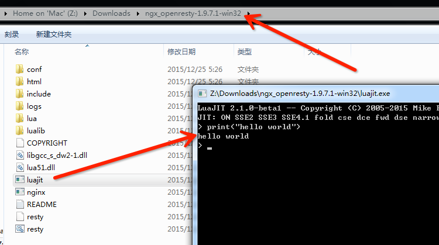

# Lua 环境搭建

#### 在 Windows 上搭建环境

从 1.9.3.2 版本开始，OpenResty 正式对外同时公布维护了 Windows 版本，其中直接包含了编译好的最新版本 LuaJIT。由于 Windows 操作系统自身相对良好的二进制兼容性，使用者只需要下载、解压两个步骤即可。

打开 [http://openresty.org](http://openresty.org/)，选择左侧的 `Download` 连接，这时候我们就可以下载最新版本的 OpenResty 版本（例如笔者写书时的最新版本：[ngx_openresty-1.9.7.1-win32.zip](https://openresty.org/download/ngx_openresty-1.9.7.1-win32.zip)）。下载本地成功后，执行解压缩，就能看到下图所示目录结构：



双击图中的 LuaJIT.exe，即可进入命令行模式，在这里我们就可以直接完成简单的 Lua 语法交互了。

#### 在 Linux、Mac OS X 上搭建环境

到 LuaJIT 官网 [http://luajit.org/download.html](http://luajit.org/download.html)，查看当前最新开发版本，例如笔者写书时的最新版本：[http://luajit.org/download/LuaJIT-2.1.0-beta1.tar.gz](http://luajit.org/download/LuaJIT-2.1.0-beta1.tar.gz)。

```
# wget http://luajit.org/download/LuaJIT-2.1.0-beta1.tar.gz
# tar -xvf LuaJIT-2.1.0-beta1.tar.gz
# cd LuaJIT-2.1.0-beta1
# make
# sudo make install
```

大家都知道，在不同平台，可能都有不同的安装工具来简化我们的安装。为什么我们这给大家推荐的是源码这么原始的方式？笔者为了偷懒么？答案：是的。当然还有另外一个原因，就是我们安装的是 LuaJIT 2.1 版本。

从实际应用性能表现来看，LuaJIT 2.1 虽然目前还是 beta 版本，但是生产运行稳定性已经很不错，并且在运行效率上要比 LuaJIT 2.0 好很多（大家可自行爬文了解一下），所以作为 OpenResty 的默认搭档，已经是 LuaJIT 2.1 很久了。但是针对不同系统的工具包安装工具，他们当前默认绑定推送的都还是 LuaJIT 2.0，所以这里就直接给出最符合我们最终方向的安装方法了。

###### 验证 LuaJIT 是否安装成功

```
# luajit -v
LuaJIT 2.1.0-beta1 -- Copyright (C) 2005-2015 Mike Pall.
http://luajit.org/
```

如果想了解其他系统安装 LuaJIT 的步骤，或者安装过程中遇到问题，可以到 LuaJIT 官网查看：[http://luajit.org/install.html](http://luajit.org/install.html)

#### 第一个“Hello World”

安装好 LuaJIT 后，开始我们的第一个 hello world 小程序。首先编写一个 hello.lua 文件，写入内容后，使用 LuaJIT 运行即可。

```
# cat hello.lua
print("hello world")
# luajit hello.lua
hello world
```
