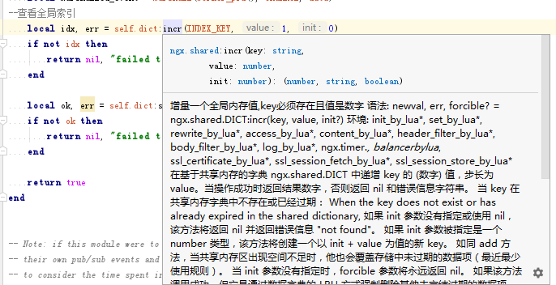

# Lua 编辑器选择

一个好用趁手的编辑器可以为我们带来极大的工作效率提升，Lua 本身并不挑编辑器，程序文件只是一个纯文本。
但是如果能有代码提示，方便的 goto 跳转，在我们理解别人的代码效率上将会有极大的提升。

我从最初的记事本编辑，vi，到后来的 UE 自定义语法高亮和函数列表，以及 scite 等，寻找和尝试过能找到的绝大部分的 Lua 编辑器。
我想在编辑器选择上面 (Linux 下的不熟= =) 应该比较有发言权。 这里我主要讲我的环境是如何配置的。

## VS Code

VSCode(Visual Studio Code) 是一个号称“重新定义代码编辑”的可到处运行（跨平台）的开源软件。它同时支持 Windows、Linux、Mac 等平台，通过丰富的插件扩展器功能，当然最重要的是，它完全免费！

### 为什么选择 VS Code？

免费免费的里面，虽然有很多好用的，但是各有缺点：

- Win 的 Notepad++：性能强，功能多，但颜值不高，也不支持其他平台 
- Sublime：颜值高，但是功能总体上算一般 
- Atom：功能一般，有一定用户量 
- Eclipse 家族：功能强，支持插件扩展，但太臃肿，性能差，其次 Lua 和 Openresty 插件比较弱

收费里面，有很多很强的，比如 JetBrains

因此，VS Code 诞生了：不仅好用，还免费！VS Code 该有的都有了包括很多不支持的或者功能不够完善的，比如：
- 列模式包括很多（如 Sublime，Atom 等）
- 文件编码（检测和转换）、全局和当前文件的搜索、搜索支持正则功能
- 支持插件扩展。理论上：功能可无限增加，随便列举几个常用的好用的：`Markdown Preview Enhancedindent-rainbowBracket Pair ColorizerPaste Image` 
- 性能好。使用 Notepad++打开几百 M 或者更大的大文件的人，知道我在说什么；VSCode 打开大文件，秒开，即便开多个窗口，依旧非常流畅

### 下载 VS Code 并配置

在官网下载即可：[下载链接](https://code.visualstudio.com/)

傻瓜式一键安装，无需任何配置

### 推荐插件

Openresty 开发者推荐 EmmyLua 插件


Lua 开发者（通常是游戏开发者）推荐 `Lua Helper` 插件


### 使用技巧

#### 使用插件格式化代码

代码格式化是一个无聊但又重要的工作，我们通常会使用专门的格式化工具来格式化代码（比如 golang 中的`go fmt`，或者 lua 的`lua-format`工具）。在 VS Code 平台，我们可以使用`emmyLua/LuaHelper/vscode-lua` 插件内置的代码格式化工具来格式化 Lua 代码。

具体流程如下：

1. 安装插件，参考前面的安装流程

2. 打开 VS Code 命令面板。左上角`查看->命令面板`，Windows 快捷键`Ctrl+Shift+P`，Mac 快捷键`Command+Shift+P`。


3. 搜索关键字`format`，选择`格式化文档/Format Document`即可


## IDEA

本章节讲解如何在你自己的 Windows 上配置好 IDE。

### 下载 IDEA 并配置

IDEA 是一个在 Java 语言开发者中广受好评的编辑器，但是并不是只支持 Java。

目前通过开放的插件机制已经支持绝大部分语言且非常地好用顺手，相信使用过的都会有深切感受的。[下载地址](https://www.jetbrains.com/idea/download/#section=windows)

其中 Community 版本是免费的，下载完后双击安装即可。

安装完成后打开 File->Settings->Plugins 在其中输入 Emmylua 点击右边的 install 安装并重启 IDEA。


新建一个 Lua 项目
在 File->Project Structure 里面配置好 modules 和 lib，如下图。


至此一个包含 Lua 语法提示和调试的编辑器环境就配置好了。

有关 Emmylua 的详细帮助文档请看 [这里](https://emmylua.github.io/zh_CN/)

### 插件基本用法
**1. 方法提示**

你可以在 Setting 里面配置鼠标移动到方法上之后，自动弹出其相关说明的延迟时间


也可以按 Ctrl+q 手动弹出，效果如下 (= =目前我使用的版本文档中的换行显示还有问题）


**2. 快速跳转**

在任何已经被定义的方法上按住 Ctrl+鼠标点击该方法就可以自动打开和跳转到方法定义上面，非常方便。

**3. 方法提示**

在你输入识别的全局或者局部变量上面按点会自动出现可选方法作为提示，不用记住所有的方法。


### 进阶配置
由于 Emmylua 并没有自带 OpenResty 的库函数，所以我们需要自己写函数提示，这里我提供自己写的供你们 [下载](/codes/emmylua_ngx.lua) 和丰富。 请使用“右键-->另存为”方式下载，然后丢到你的 lualib 根目录中。

下面是一个简单的库函数定义示例：

```lua
---语法：pid = ngx.worker.pid()
---
---语法：set_by_lua*， rewrite_by_lua*， access_by_lua*， content_by_lua*， header_filter_by_lua*， body_filter_by_lua*， log_by_lua*， ngx.timer.*， init_by_lua*， init_worker_by_lua*
---
---这个函数返回一个 Lua 数字，它是当前 Nginx 工作进程的进程 ID （PID）。 这个 API 比 ngx.var.pid 更有效，ngx.var.VARIABLE API 不能使用的地方（例如 init_worker_by_lua），该 API 是可以的。
---@return number
function ngx.worker.pid()
end
```

方法提示不一定要使用独立的文件定义，可以直接在库里面定义，如：


至于里面的含义就要去 [这里](https://emmylua.github.io/zh_CN/) 看和理解啦。

总之，如果你的库都定义好了方法提示，在你理解源码的时候将会非常方便快速。 相信我。
