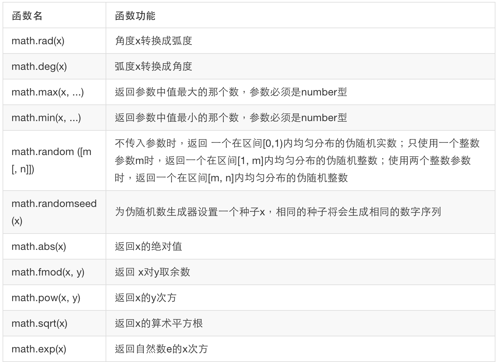
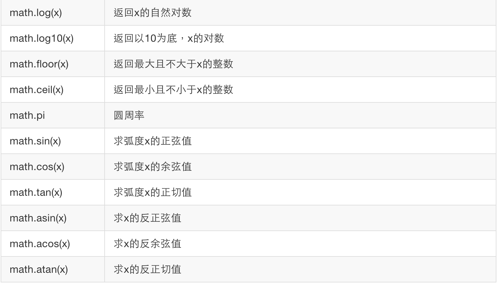

#数学库
Lua数学库由一组标准的数学函数构成。数学库的引入丰富了Lua编程语言的功能，同时也方便了程序的编写。常用数学函数见下表：





>示例代码：

```lua
print(math.pi)           -->output  3.1415926535898
print(math.rad(180))     -->output  3.1415926535898
print(math.deg(math.pi)) -->output  180

print(math.sin(1))       -->output  0.8414709848079
print(math.cos(math.pi)) -->output  -1
print(math.tan(math.pi / 4))  -->output  1

print(math.atan(1))      -->output  0.78539816339745
print(math.asin(0))      -->output  0

print(math.max(-1, 2, 0, 3.6, 9.1))     -->output  9.1
print(math.min(-1, 2, 0, 3.6, 9.1))     -->output  -1

print(math.fmod(10.1, 3))   -->output  1.1
print(math.sqrt(360))      -->output  18.97366596101

print(math.exp(1))         -->output  2.718281828459
print(math.log(10))        -->output  2.302585092994
print(math.log10(10))      -->output  1

print(math.floor(3.1415))  -->output  3
print(math.ceil(7.998))    -->output  8

```

另外使用math.random()函数获得伪随机数时，如果不使用math.randomseed ()设置伪随机数生成种子或者设置相同的伪随机数生成种子，那么得得到的伪随机数序列是一样的。

>示例代码：

```lua
math.randomseed (100) --把种子设置为100
print(math.random())         -->output  0.0012512588885159
print(math.random(100))      -->output  57
print(math.random(100, 360)) -->output  150
```

稍等片刻，再次运行上面的代码。

```lua
math.randomseed (100) --把种子设置为100
print(math.random())         -->output  0.0012512588885159
print(math.random(100))      -->output  57
print(math.random(100, 360)) -->output  150
```

两次运行的结果一样。为了避免每次程序启动时得到的都是相同的伪随机数序列，通常是使用当前时间作为种子。

>修改上例中的代码：

```lua

math.randomseed (os.time())   --把100换成os.time()
print(math.random())          -->output 0.88369396038697
print(math.random(100))       -->output 66
print(math.random(100, 360))  -->output 228
```

稍等片刻，再次运行上面的代码。

```lua
math.randomseed (os.time())   --把100换成os.time()
print(math.random())          -->output 0.88946195867794
print(math.random(100))       -->output 68
print(math.random(100, 360))  -->output 129
```
