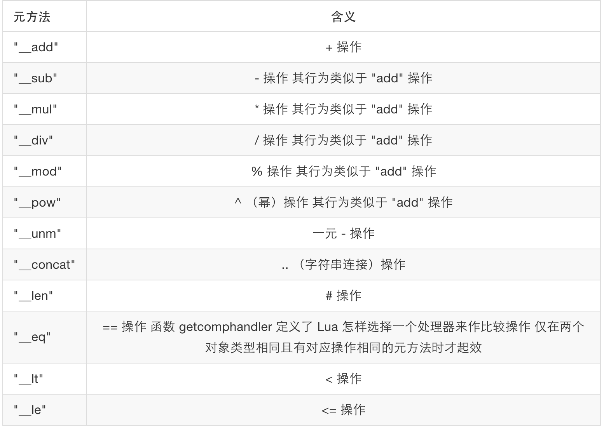
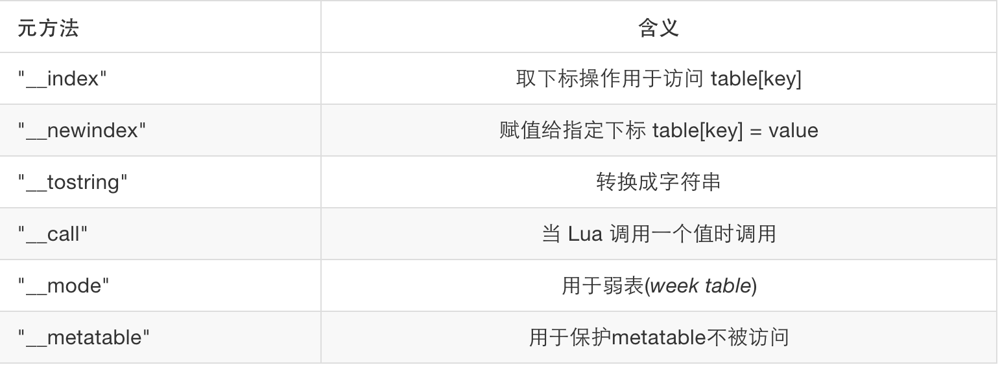

# 元表

在 Lua 5.1 语言中，元表 *(metatable)* 的表现行为类似于 C++ 语言中的操作符重载，例如我们可以重载 "\_\_add" 元方法 *(metamethod)* ，来计算两个 Lua 数组的并集；或者重载 "\_\_index" 方法，来定义我们自己的 Hash 函数。Lua 提供了两个十分重要的用来处理元表的方法，如下：

- setmetatable(table, metatable)：此方法用于为一个表设置元表。
- getmetatable(table)：此方法用于获取表的元表对象。

设置元表的方法很简单，如下：

```lua
local mytable = {}
local mymetatable = {}
setmetatable(mytable, mymetatable)
```

上面的代码可以简写成如下的一行代码：

```lua
local mytable = setmetatable({}, {})
```


#### 修改表的操作符行为

通过重载 "\_\_add" 元方法来计算集合的并集实例：

```lua
local set1 = {10, 20, 30}   -- 集合
local set2 = {20, 40, 50}   -- 集合

-- 将用于重载__add的函数，注意第一个参数是self
local union = function (self, another)
	local set = {}
	local result = {}

	-- 利用数组来确保集合的互异性
	for i, j in pairs(self) do set[j] = true end
	for i, j in pairs(another) do set[j] = true end

	-- 加入结果集合
	for i, j in pairs(set) do table.insert(result, i) end
	return result
end
setmetatable(set1, {__add = union}) -- 重载 set1 表的 __add 元方法

local set3 = set1 + set2
for _, j in pairs(set3) do
	io.write(j.." ")               -->output：10 30 20 40 50
end
```

除了加法可以被重载之外，Lua 提供的所有操作符都可以被重载：



除了操作符之外，如下元方法也可以被重载，下面会依次解释使用方法：




#### \_\_index 元方法

下面的例子中，我们实现了在表中查找键不存在时转而在元表中查找该键的功能：

```lua
mytable = setmetatable({key1 = "value1"},   --原始表
  {__index = function(self, key)            --重载函数
    if key == "key2" then
      return "metatablevalue"
    end
  end
})

print(mytable.key1,mytable.key2)  --> output：value1 metatablevalue
```

关于 \_\_index 元方法，有很多比较高阶的技巧，例如： \_\_index 的元方法不需要非是一个函数，他也可以是一个表。

```lua
t = setmetatable({[1] = "hello"}, {__index = {[2] = "world"}})
print(t[1], t[2])   -->hello world
```

第一句代码有点绕，解释一下：先是把 {\_\_index = {}} 作为元表，但 \_\_index 接受一个表，而不是函数，这个表中包含 [2] = "world" 这个键值对。
所以当 t[2] 去在自身的表中找不到时，在 \_\_index 的表中去寻找，然后找到了 [2] = "world" 这个键值对。

\_\_index 元方法还可以实现给表中每一个值赋上默认值；和 \_\_newindex 元方法联合监控对表的读取、修改等比较高阶的功能，待读者自己去开发吧。

#### \_\_tostring 元方法

与 Java 中的 toString() 函数类似，可以实现自定义的字符串转换。

```lua
arr = {1, 2, 3, 4}
arr = setmetatable(arr, {__tostring = function (self)
	local result = '{'
	local sep = ''
	for _, i in pairs(self) do
		result = result ..sep .. i
		sep = ', '
	end
	result = result .. '}'
	return result
end})
print(arr)  --> {1, 2, 3, 4}
```

#### \_\_call元方法

\_\_call 元方法的功能类似于 C++ 中的仿函数，使得普通的表也可以被调用。

```lua
functor = {}
function func1(self, arg)
  print ("called from", arg)
end

setmetatable(functor, {__call = func1})

functor("functor")  --> called from functor
print(functor)      --> output：0x00076fc8 （后面这串数字可能不一样）
```

#### \_\_metatable元方法

假如我们想保护我们的对象使其使用者既看不到也不能修改 metatables。我们可以对 metatable 设置了 \_\_metatable 的值， getmetatable 将返回这个域的值， 而调用 setmetatable 将会出错：

```lua
Object = setmetatable({}, {__metatable = "You cannot access here"})

print(getmetatable(Object)) --> You cannot access here
setmetatable(Object, {})    --> 引发编译器报错
```
