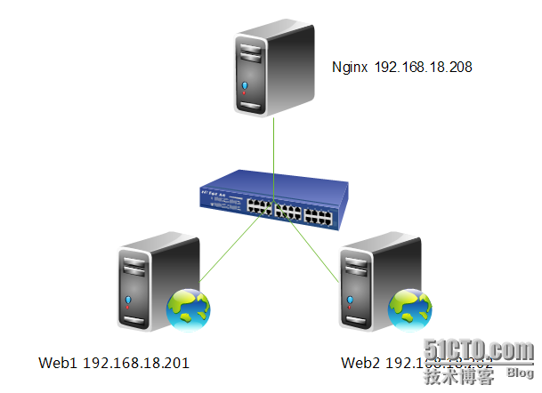

# 负载均衡

网站发展初期，Nginx 后端往往只代理一台服务器，但当你的网站名气大涨访问的人越来越多一台服务器实在是顶不住，于是我们就需要多台服务器，那么多台服务器又怎么配置代理呢，我们这里以两台服务器为案例，为大家做演示。

#### upstream 负载均衡模块说明

案例：

```nginx
upstream test.net{
    ip_hash;
    server 192.168.10.13:80;
    server 192.168.10.14:80  down;
    server 192.168.10.15:8009  max_fails=3  fail_timeout=20s;
    server 192.168.10.16:8080;
}
server {
  location / {
    proxy_pass  http://test.net;
  }
}
```

upstream 是 Nginx 的 HTTP Upstream 模块，这个模块通过一个简单的调度算法来实现客户端 IP 到后端服务器的负载均衡。在上面的设定中，通过 upstream 指令指定了一个负载均衡器的名称 test.net。这个名称可以任意指定，在后面需要用到的地方直接调用即可。

#### upstream 支持的负载均衡算法

Nginx的负载均衡模块目前支持4种调度算法，下面进行分别介绍，其中后两项属于第三方调度算法。  

* 轮询（默认）。每个请求按时间顺序逐一分配到不同的后端服务器，如果后端某台服务器宕机，故障系统被自动剔除，使用户访问不受影响。Weight 指定轮询权值，Weight值越大，分配到的访问机率越高，主要用于后端每个服务器性能不均的情况下。
* ip_hash。每个请求按访问IP的hash结果分配，这样来自同一个IP的访客固定访问一个后端服务器，有效解决了动态网页存在的session共享问题。
* fair。这是比上面两个更加智能的负载均衡算法。此种算法可以依据页面大小和加载时间长短智能地进行负载均衡，也就是根据后端服务器的响应时间来分配请求，响应时间短的优先分配。Nginx本身是不支持fair的，如果需要使用这种调度算法，必须下载Nginx的upstream_fair模块。
* url_hash。此方法按访问url的hash结果来分配请求，使每个url定向到同一个后端服务器，可以进一步提高后端缓存服务器的效率。Nginx本身是不支持url_hash的，如果需要使用这种调度算法，必须安装Nginx 的hash软件包。

#### upstream 支持的状态参数

在HTTP Upstream模块中，可以通过server指令指定后端服务器的IP地址和端口，同时还可以设定每个后端服务器在负载均衡调度中的状态。常用的状态有：      

* down，表示当前的server暂时不参与负载均衡。
* backup，预留的备份机器。当其他所有的非backup机器出现故障或者忙的时候，才会请求backup机器，因此这台机器的压力最轻。
* max_fails，允许请求失败的次数，默认为1。当超过最大次数时，返回proxy_next_upstream 模块定义的错误。
* fail_timeout，在经历了max_fails次失败后，暂停服务的时间。max_fails可以和fail_timeout一起使用。

*当负载调度算法为ip_hash时，后端服务器在负载均衡调度中的状态不能是weight和backup。*

#### 配置nginx负载均衡



> Nginx 配置负载均衡

```nginx
upstream webservers {
      server 192.168.18.201 weight=1;
      server 192.168.18.202 weight=1;
  }
  server {
      listen       80;
      server_name  localhost;
      #charset koi8-r;
      #access_log  logs/host.access.log  main;
      location / {
              proxy_pass      http://webservers;
              proxy_set_header  X-Real-IP  $remote_addr;
      }
}
```

注，upstream 是定义在 server{ } 之外的，不能定义在 server{ } 内部。定义好 upstream 之后，用 proxy_pass 引用一下即可。

> 重新加载一下配置文件

```shell
[root@nginx ~]# service nginx reload
nginx: the configuration file /etc/nginx/nginx.conf syntax is ok
nginx: configuration file /etc/nginx/nginx.conf test is successful
```

```shell
[root@nginx ~]# curl http://192.168.18.208
web1.test.com
[root@nginx ~]# curl http://192.168.18.208
web2.test.com
[root@nginx ~]# curl http://192.168.18.208
web1.test.com
[root@nginx ~]# curl http://192.168.18.208
web2.test.com
```

注，大家可以不断的刷新浏览的内容，可以发现web1与web2是交替出现的，达到了负载均衡的效果。

> 查看一下Web访问服务器日志

Web1:

```shell
[root@web1 ~]# tail /var/log/httpd/access_log
192.168.18.138 - - [04/Sep/2013:09:41:58 +0800] "GET / HTTP/1.0" 200 23 "-"
192.168.18.138 - - [04/Sep/2013:09:41:58 +0800] "GET / HTTP/1.0" 200 23 "-"
192.168.18.138 - - [04/Sep/2013:09:41:59 +0800] "GET / HTTP/1.0" 200 23 "-"
192.168.18.138 - - [04/Sep/2013:09:41:59 +0800] "GET / HTTP/1.0" 200 23 "-"
192.168.18.138 - - [04/Sep/2013:09:42:00 +0800] "GET / HTTP/1.0" 200 23 "-"
192.168.18.138 - - [04/Sep/2013:09:42:00 +0800] "GET / HTTP/1.0" 200 23 "-"
192.168.18.138 - - [04/Sep/2013:09:42:00 +0800] "GET / HTTP/1.0" 200 23 "-"
192.168.18.138 - - [04/Sep/2013:09:44:21 +0800] "GET / HTTP/1.0" 200 23 "-"
192.168.18.138 - - [04/Sep/2013:09:44:22 +0800] "GET / HTTP/1.0" 200 23 "-"
192.168.18.138 - - [04/Sep/2013:09:44:22 +0800] "GET / HTTP/1.0" 200 23 "-"
```

Web2:

先修改一下，Web服务器记录日志的格式。

```shell
[root@web2 ~]# vim /etc/httpd/conf/httpd.conf
LogFormat "%{X-Real-IP}i %l %u %t \"%r\" %>s %b \"%{Referer}i\" \"%{User-Agent}i\"" combined
[root@web2 ~]# service httpd restart
停止 httpd：                                               [确定]
正在启动 httpd：                                           [确定]
[root@web2 ~]# tail /var/log/httpd/access_log
192.168.18.138 - - [04/Sep/2013:09:50:28 +0800] "GET / HTTP/1.0" 200 23 "-"
192.168.18.138 - - [04/Sep/2013:09:50:28 +0800] "GET / HTTP/1.0" 200 23 "-"
192.168.18.138 - - [04/Sep/2013:09:50:28 +0800] "GET / HTTP/1.0" 200 23 "-"
192.168.18.138 - - [04/Sep/2013:09:50:28 +0800] "GET / HTTP/1.0" 200 23 "-"
192.168.18.138 - - [04/Sep/2013:09:50:28 +0800] "GET / HTTP/1.0" 200 23 "-"
192.168.18.138 - - [04/Sep/2013:09:50:28 +0800] "GET / HTTP/1.0" 200 23 "-"
192.168.18.138 - - [04/Sep/2013:09:50:28 +0800] "GET / HTTP/1.0" 200 23 "-"
192.168.18.138 - - [04/Sep/2013:09:50:28 +0800] "GET / HTTP/1.0" 200 23 "-"
192.168.18.138 - - [04/Sep/2013:09:50:29 +0800] "GET / HTTP/1.0" 200 23 "-"
192.168.18.138 - - [04/Sep/2013:09:50:29 +0800] "GET / HTTP/1.0" 200 23 "-"
```

*注，大家可以看到，两台服务器日志都记录是192.168.18.138访问的日志，也说明了负载均衡配置成功。*

#### 配置nginx进行健康状态检查

max_fails，允许请求失败的次数，默认为1。当超过最大次数时，返回proxy_next_upstream 模块定义的错误。

fail_timeout，在经历了max_fails次失败后，暂停服务的时间。max_fails可以和fail_timeout一起使用，进行健康状态检查。

```shell
[root@nginx ~]# vim /etc/nginx/nginx.conf
upstream webservers {
        server 192.168.18.201 weight=1 max_fails=2 fail_timeout=2;
        server 192.168.18.202 weight=1 max_fails=2 fail_timeout=2;
    }
```

重新加载一下配置文件:

```shell
[root@nginx ~]# service nginx reload
nginx: the configuration file /etc/nginx/nginx.conf syntax is ok
nginx: configuration file /etc/nginx/nginx.conf test is successful
重新载入 nginx：                                           [确定]
```

先停止Web1，进行测试：

```shell
[root@web1 ~]# service httpd stop
停止 httpd：                                               [确定]
```

```shell
[root@nginx ~]# curl http://192.168.18.208
web2.test.com
[root@nginx ~]# curl http://192.168.18.208
web2.test.com
[root@nginx ~]# curl http://192.168.18.208
web2.test.com
```

*注，大家可以看到，现在只能访问Web2，再重新启动Web1，再次访问一下。*

```shell
[root@web1 ~]# service httpd start
正在启动 httpd：                                           [确定]
```

```shell
[root@nginx ~]# curl http://192.168.18.208
web1.test.com
[root@nginx ~]# curl http://192.168.18.208
web2.test.com
[root@nginx ~]# curl http://192.168.18.208
web1.test.com
[root@nginx ~]# curl http://192.168.18.208
web2.test.com
```

*注，大家可以看到，现在又可以重新访问，说明 nginx 的健康状态查检配置成功。但大家想一下，如果不幸的是所有服务器都不能提供服务了怎么办，用户打开页面就会出现出错页面，那么会带来用户体验的降低，所以我们能不能像配置 LVS 是配置 sorry_server 呢，答案是可以的，但这里不是配置 sorry_server 而是配置 backup。*

#### 配置backup服务器

```shell
[root@nginx ~]# vim /etc/nginx/nginx.conf
server {
                listen 8080;
                server_name localhost;
                root /data/www/errorpage;
                index index.html;
        }
upstream webservers {
        server 192.168.18.201 weight=1 max_fails=2 fail_timeout=2;
        server 192.168.18.202 weight=1 max_fails=2 fail_timeout=2;
        server 127.0.0.1:8080 backup;
    }
[root@nginx ~]# mkdir -pv /data/www/errorpage
[root@nginx errorpage]# cat index.html
<h1>Sorry......</h1>
```

重新加载配置文件：

```shell
[root@nginx errorpage]# service nginx reload
nginx: the configuration file /etc/nginx/nginx.conf syntax is ok
nginx: configuration file /etc/nginx/nginx.conf test is successful
重新载入 nginx：                                           [确定]
```

关闭Web服务器并进行测试：

```shell
[root@web1 ~]# service httpd stop
停止 httpd：                                               [确定]
[root@web2 ~]# service httpd stop
停止 httpd：                                               [确定]
```

进行测试：

```shell
[root@nginx ~]# curl http://192.168.18.208
<h1>Sorry......</h1>
[root@nginx ~]# curl http://192.168.18.208
<h1>Sorry......</h1>
[root@nginx ~]# curl http://192.168.18.208
<h1>Sorry......</h1>
```

*注，大家可以看到，当所有服务器都不能工作时，就会启动备份服务器。好了，backup服务器就配置到这里，下面我们来配置ip_hash负载均衡。*

#### 配置ip_hash负载均衡

ip_hash，每个请求按访问IP的hash结果分配，这样来自同一个IP的访客固定访问一个后端服务器，有效解决了动态网页存在的session共享问题。（一般电子商务网站用的比较多）

```shell
[root@nginx ~]# vim /etc/nginx/nginx.conf
upstream webservers {
        ip_hash;
        server 192.168.18.201 weight=1 max_fails=2 fail_timeout=2;
        server 192.168.18.202 weight=1 max_fails=2 fail_timeout=2;
        #server 127.0.0.1:8080 backup;
    }
```

注，当负载调度算法为ip_hash时，后端服务器在负载均衡调度中的状态不能有backup。（有人可能会问，为什么呢？大家想啊，如果负载均衡把你分配到backup服务器上，你能访问到页面吗？不能，所以了不能配置backup服务器）

重新加载一下服务器：

```shell
[root@nginx ~]# service nginx reload
nginx: the configuration file /etc/nginx/nginx.conf syntax is ok
nginx: configuration file /etc/nginx/nginx.conf test is successful
重新载入 nginx：                                           [确定]
```

测试一下：

```shell
[root@nginx ~]# curl http://192.168.18.208
web2.test.com
[root@nginx ~]# curl http://192.168.18.208
web2.test.com
[root@nginx ~]# curl http://192.168.18.208
web2.test.com
```

注，大家可以看到，你不断的刷新页面一直会显示的民Web2，说明ip_hash负载均衡配置成功。
