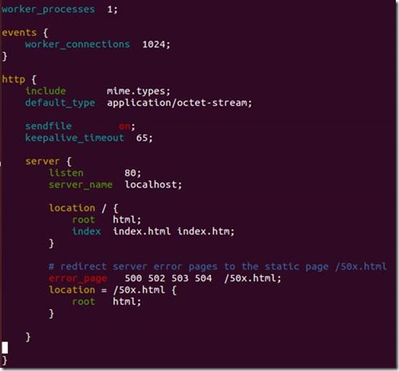

# Nginx 新手起步

#### 为什选择 Nginx

为什么选择 Nginx？因为它具有以下特点：

1、处理响应请求很快

在正常的情况下，单次请求会得到更快的响应。在高峰期，Nginx 可以比其它的 Web 服务器更快的响应请求。

2、高并发连接

在互联网快速发展，互联网用户数量不断增加的今天，一些大公司、网站都需要面对高并发请求，如果有一个能够在峰值顶住 10 万以上并发请求的 Server，肯定会得到大家的青睐。理论上，Nginx 支持的并发连接上限取决于你的内存，10 万远未封顶。

3、低的内存消耗

在一般的情况下，10000 个非活跃的 HTTP Keep-Alive 连接在 Nginx 中仅消耗 2.5MB 的内存，这也是 Nginx 支持高并发连接的基础。

4、具有很高的可靠性：

Nginx 是一个高可靠性的 Web 服务器，这也是我们为什么选择 Nginx 的基本条件，现在很多的网站都在使用 Nginx，足以说明 Nginx 的可靠性。高可靠性来自其核心框架代码的优秀设计、模块设计的简单性，并且这些模块都非常的稳定。

5、高扩展性

Nginx 的设计极具扩展性，它完全是由多个不同功能、不同层次、不同类型且耦合度极低的模块组成。这种设计造就了 Nginx 庞大的第三方模块。

6、热部署

master 管理进程与 worker 工作进程的分离设计，使得 Nginx 具有热部署的功能，可以在 7 × 24 小时不间断服务的前提下，升级 Nginx 的可执行文件。也可以在不停止服务的情况下修改配置文件，更换日志文件等功能。

7、自由的 BSD 许可协议

BSD 许可协议不只是允许用户免费使用 Nginx，也允许用户修改 Nginx 源码，还允许用户用于商业用途。

#### 如何使用 Nginx

Nginx 安装：

不同系统依赖包可能不同，例如 pcre，zlib，openssl 等。

1. 获取 Nginx，在 http://nginx.org/en/download.html 上可以获取当前最新的版本。
2. 解压缩 nginx-xx.tar.gz 包。
3. 进入解压缩目录，执行 ./configure
4. make & make install

若安装时找不到上述依赖模块，使用 --with-openssl=`<openssl_dir>`、--with-pcre=`<pcre_dir>`、--with-zlib=`<zlib_dir>` 指定依赖的模块目录。如已安装过，此处的路径为安装目录；若未安装，则此路径为编译安装包路径，Nginx 将执行模块的默认编译安装。

启动 Nginx 之后，浏览器中输入 http://localhost 可以验证是否安装启动成功。


Nginx 配置示例:

安装完成之后，配置目录 conf 下有以下配置文件，过滤掉了 xx.default 配置：

```shell
ubuntu: /opt/nginx-1.7.7/conf$ tree |grep -v default
.
├── fastcgi.conf
├── fastcgi_params
├── koi-utf
├── koi-win
├── mime.types
├── nginx.conf
├── scgi_params
├── uwsgi_params
└── win-utf
```

除了 `nginx.conf`，其余配置文件，一般只需要使用默认提供即可。

`nginx.conf` 是主配置文件，默认配置去掉注释之后的内容如下图所示：

```nginx
worker_process      # 表示工作进程的数量，一般设置为cpu的核数

worker_connections  # 表示每个工作进程的最大连接数

server{}            # 块定义了虚拟主机

    listen          # 监听端口

    server_name     # 监听域名

    location {}     # 是用来为匹配的 URI 进行配置，URI 即语法中的“/uri/”

    location /{}    # 匹配任何查询，因为所有请求都以 / 开头

        root        # 指定对应uri的资源查找路径，这里html为相对路径，完整路径为
                    # /opt/nginx-1.7.7/html/

        index       # 指定首页index文件的名称，可以配置多个，以空格分开。如有多
                    # 个，按配置顺序查找。
```

> 真实用例



从配置可以看出，Nginx 监听了 80 端口、域名为 localhost、根路径为 html 文件夹（我的安装路径为 /opt/nginx-1.7.7，所以 /opt/nginx-1.7.7/html）、默认 index 文件为 index.html，index.htm 服务器错误重定向到 50x.html 页面。

可以看到 /opt/nginx-1.7.7/html/ 有以下文件：

```shell
ubuntu:/opt/nginx-1.7.7/html$ ls
50x.html  index.html
```

这也是上面在浏览器中输入 `http://localhost`，能够显示欢迎页面的原因。实际上访问的是 `/opt/nginx-1.7.7/html/index.html` 文件。
