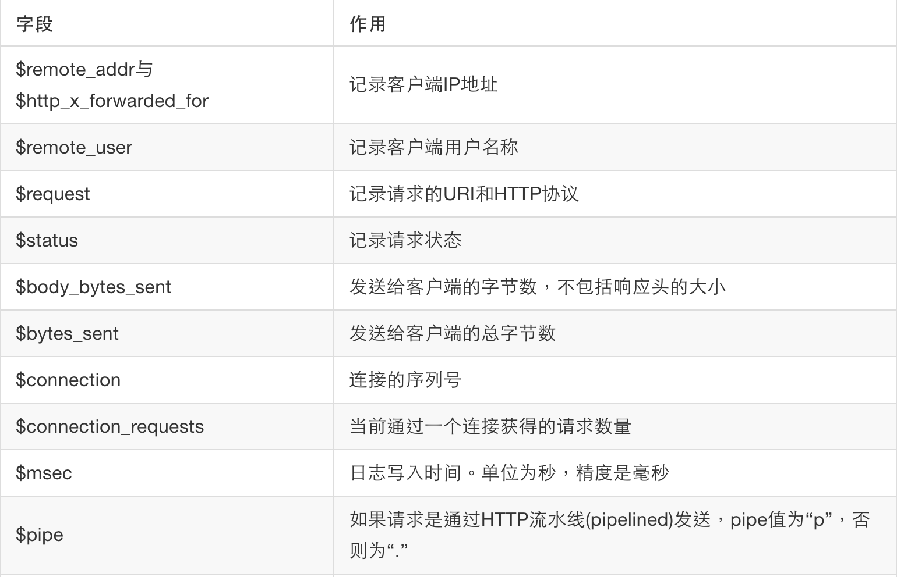
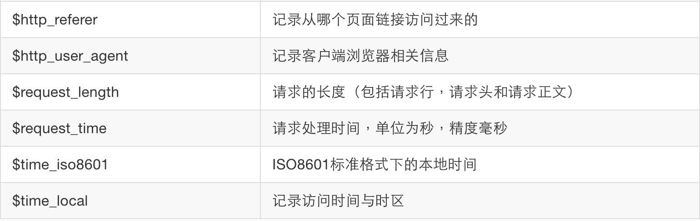

# 日志

Nginx 日志主要有两种：access_log(访问日志)、error_log(错误日志)。

## access_log 访问日志

access_log主要记录客户端访问Nginx的每一个请求，格式可以自定义。通过access_log，你可以得到用户地域来源、跳转来源、使用终端、某个URL访问量等相关信息。

log_format指令用于定义日志的格式，语法: log_format name string; 其中name表示格式名称，string表示定义的格式字符串。log_format有一个默认的无需设置的combined日志格式。

>默认的无需设置的combined日志格式

```
log_format combined '$remote_addr - $remote_user  [$time_local]  '
                    ' "$request"  $status  $body_bytes_sent  '
                    ' "$http_referer"  "$http_user_agent" ';
```

access_log指令用来指定访问日志文件的存放路径（包含日志文件名）、格式和缓存大小，语法：access_log path [format_name [buffer=size | off]]; 其中path表示访问日志存放路径，format_name表示访问日志格式名称，buffer表示缓存大小，off表示关闭访问日志。

>log_format使用事例：在access.log中记录客户端IP地址、请求状态和请求时间

```
log_format myformat '$remote_addr  $status  $time_local';
access_log logs/access.log  myformat;
```

需要注意的是：log_format配置必须放在http内，否则会出现警告。Nginx进程设置的用户和组必须对日志路径有创建文件的权限，否则，会报错。

定义日志使用的字段及其作用：





## error_log(错误日志)

error_log主要记录客户端访问Nginx出错时的日志，格式不支持自定义。通过查看错误日志，你可以得到系统某个服务或server的性能瓶颈等。因此，将日志好好利用，你可以得到很多有价值的信息。

error_log指令用来指定错误日志，语法: error_log path(存放路径) level(日志等级); 其中path表示错误日志存放路径，level表示错误日志等级，日志等级包括debug、info、notice、warn、error、crit，从左至右，日志详细程度逐级递减，即debug最详细，crit最少，默认为crit。

注意：error_log off并不能关闭错误日志记录，此时日志信息会被写入到文件名为off的文件当中。如果要关闭错误日志记录，可以使用如下配置：

>Linux系统把存储位置设置为空设备

```
error_log /dev/null;
```

>Windows系统把存储位置设置为空设备

```
error_log nul;
```

另外Linux系统可以使用tail命令方便的查阅正在改变的文件,tail -f filename会把filename里最尾部的内容显示在屏幕上,并且不断刷新,使你看到最新的文件内容。Windows系统没有这个命令，你可以在网上找到动态查看文件的工具。
