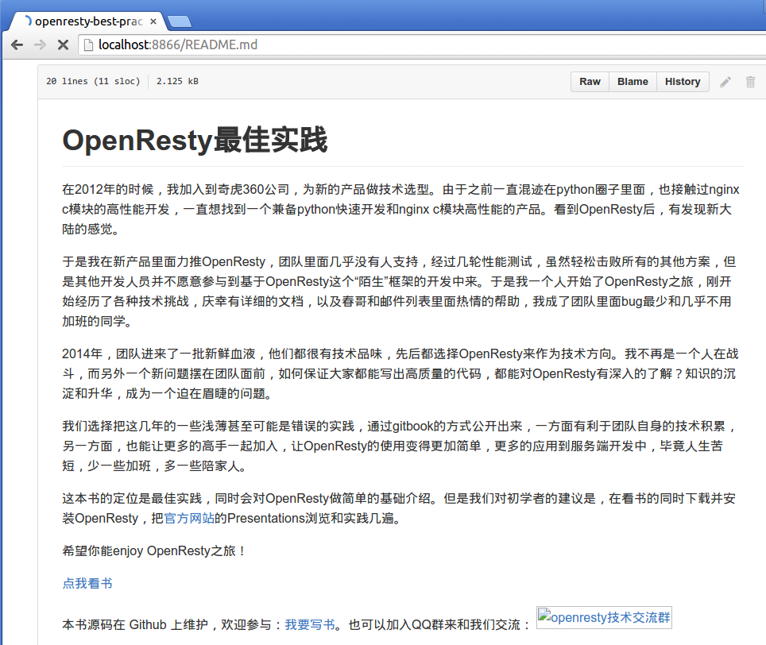

# 反向代理

#### 什么是反向代理

**反向代理**（Reverse Proxy）方式是指用代理服务器来接受 internet 上的连接请求，然后将请求转发给内部网络上的服务器，并将从服务器上得到的结果返回给 internet 上请求连接的客户端，此时代理服务器对外就表现为一个反向代理服务器。

举个例子，一个用户访问 [http://www.example.com/readme](http://www.example.com/readme)，但是 www.example.com 上并不存在 readme 页面，它是偷偷从另外一台服务器上取回来，然后作为自己的内容返回给用户。但是用户并不知情这个过程。对用户来说，就像是直接从 www.example.com 获取 readme 页面一样。这里所提到的 www.example.com 这个域名对应的服务器就设置了反向代理功能。

反向代理服务器，对于客户端而言它就像是原始服务器，并且客户端不需要进行任何特别的设置。客户端向反向代理的命名空间(name-space)中的内容发送普通请求，接着反向代理将判断向何处(原始服务器)转交请求，并将获得的内容返回给客户端，就像这些内容原本就是它自己的一样。如下图所示：


#### 反向代理典型应用场景

反向代理的典型用途是将防火墙后面的服务器提供给 Internet 用户访问，加强安全防护。反向代理还可以为后端的多台服务器提供负载均衡，或为后端较慢的服务器提供 **缓冲** 服务。另外，反向代理还可以启用高级 URL 策略和管理技术，从而使处于不同 web 服务器系统的 web 页面同时存在于同一个 URL 空间下。

Nginx 的其中一个用途是做 HTTP 反向代理，下面简单介绍 Nginx 作为反向代理服务器的方法。

>场景描述：访问本地服务器上的 README.md 文件 [http://localhost:8866/README.md](http://localhost:8866/README.md)，本地服务器进行反向代理，从 [https://github.com/moonbingbing/openresty-best-practices/blob/master/README.md](https://github.com/moonbingbing/openresty-best-practices/blob/master/README.md) 获取页面内容。

nginx.conf 配置示例：

```nginx
worker_processes 1;

pid logs/nginx.pid;
error_log logs/error.log warn;

events {
    worker_connections 3000;
}

http {
    include mime.types;
    server_tokens off;

	## 下面配置反向代理的参数
    server {
        listen 8866;

        ## 1. 用户访问 http://ip:port，则反向代理到 https://github.com
        location / {
            proxy_pass  https://github.com;
            proxy_redirect     off;
            proxy_set_header   Host             $host;
            proxy_set_header   X-Real-IP        $remote_addr;
            proxy_set_header   X-Forwarded-For  $proxy_add_x_forwarded_for;
        }

        ## 2.用户访问 http://ip:port/README.md，则反向代理到
        ##   https://github.com/.../README.md
        location /README.md {
            proxy_set_header  X-Real-IP  $remote_addr;
            proxy_set_header X-Forwarded-For $proxy_add_x_forwarded_for;
            proxy_pass https://github.com/moonbingbing/openresty-best-practices/blob/master/README.md;
        }
    }
}
```

成功启动 nginx 后，我们打开浏览器，验证下反向代理的效果。在浏览器地址栏中输入 `localhost:8866/README.md`，返回的结果是我们 github 源代码的 README 页面。如下图：



我们只需要配置一下 nginx.conf 文件，不用写任何 web 页面，就可以偷偷地从别的服务器上读取一个页面返回给用户。

下面我们来看一下 nginx.conf 里用到的配置项：

（1）location

location 项对请求 URI 进行匹配，location 后面配置了匹配规则。例如上面的例子中，如果请求的 URI 是 `localhost:8866/`，则会匹配 `location /` 这一项；如果请求的 URI 是 `localhost:8866/README.md`，则会比配 `location /README.md` 这项。

上面这个例子只是针对一个确定的 URI 做了反向代理，有的读者会有疑惑：如果对每个页面都进行这样的配置，那将会大量重复，能否做 **批量** 配置呢？此时需要配合使用 location 的正则匹配功能。具体实现方法可参考本书的 [URL匹配章节](../ngx/match_uri.md)。

（2）proxy_pass

proxy_pass 后面跟着一个 URL，用来将请求反向代理到 URL 参数指定的服务器上。例如我们上面例子中的 `proxy_pass https://github.com`，则将匹配的请求反向代理到 `https://github.com`。

（3）proxy_set_header

默认情况下，反向代理不会转发原始请求中的 Host 头部，如果需要转发，就需要加上这句：`proxy_set_header Host $host;`

除了上面提到的常用配置项，还有 proxy_redirect、proxy_set_body、proxy_limit_rate 等参数，具体用法可以到[Nginx 官网](http://nginx.org/en/docs/http/ngx_http_proxy_module.html)查看。

#### 正向代理

既然有反向代理，自然也有正向代理。简单来说，正向代理就像一个跳板，例如一个用户访问不了某网站（例如 www.google.com），但是他能访问一个代理服务器，这个代理服务器能访问 www.google.com，于是用户可以先连上代理服务器，告诉它需要访问的内容，代理服务器去取回来返回给用户。例如一些常见的翻墙工具、游戏代理就是利用正向代理的原理工作的，我们需要在这些正向代理工具上配置服务器的 IP 地址等信息。
