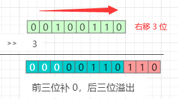

# 二，复习位运算

- [一，复习二进制补码](./bit_two's_complement.md)
- [二，复习位运算](./bit_operations_review.md)
- [三，LuaJIT 和 Lua BitOp Api](./bit_LuaJIT_BitOp_Api.md)
- [四，位运算算法实例](./bit_bitwise_operation_example.md)
- [五，Lua BitOp 的安装](./bit_bitop_installation.md)

我们先来复习一下 C 语言中，6 种代表性的位运算，OpenResty 的组件 LuaJIT 中的位运算只是稍有差异。为清晰起见本文中称呼所有的位运算的函数为「**按位 XX**」。

## 1，运算符
| 序号 | 运算符 | 含义 |
|:----:|:----:|----|
| 1 | `&` | **按位与** AND |
| 2 | `|` | **按位或** OR |
| 3 | `^` | **按位异或** XOR |
| 4 | `>>` | **按位右移** right shift |
| 5 | `<<` | **按位左移** left shift |
| 6 | `~` |  **按位取反** NOT |

## 2，位运算的示例

> **布尔代数：1 为真、0 为假。**
>
> **以下示例都只用 0 和 1 两个数字参与运算。**

### 2.1，**按位与** (AND)
**按位与**（AND）与常用的布尔代数完全一致。

运算规则：**同为 1 则 1，有 0 则 0。**

辅助记忆：**两个和尚抬水吃**，有一个不合作，就没水吃了。


### 2.2，**按位或** (OR)
**按位或**（OR）也与常用的布尔代数完全一致。

运算规则：**同为 0 则 0，有 1 则 1。**

辅助记忆：**一个和尚挑水吃**，两个和尚可以都去挑水，如果都不去，就没水吃了。


### 2.3，**按位异或** (XOR)

运算规则：**相同则为 0，相异则为 1。**

辅助记忆：两个和尚做 **相同** 的事情（都去只顾着吵架了或者都不去）没水吃，**必须不同** 才有水吃。


### 2.4，**按位右移**（right shift）
运算规则：所有位整体向 **右移**  n 位，**左侧空出来的位补 0**。

辅助记忆：把一根木条按单位锯成一堆小方块，每锯掉一块，向右移动 1 个单位（bit）。

示例：把二进制数 100110 向右移 3 位。
```
100110 >> 3 = 000100
```



> Tips：向**右移一位**，相当于将此数 **除以 2**（原数变小了）。

### 2.5，**按位左移**（left shift）
运算规则：所有位整体向 **左移** n 位，**右侧空出来的位补 0**。

辅助记忆：贪吃蛇游戏，只是每次都把小方块放在最后边。
```
100110 << 3 = 110000
```
示例：把二进制数 100110 向左移 3 位。


> Tips：向**左移一位**，相当于将此数 **乘以 2**（原数变大了）。

### 2.6，**按位取反**（NOT）
把数字的二进制表示形式的每一位的 0 变为 1，1 变为 0。

辅助记忆：谍战剧中的角色反转。


