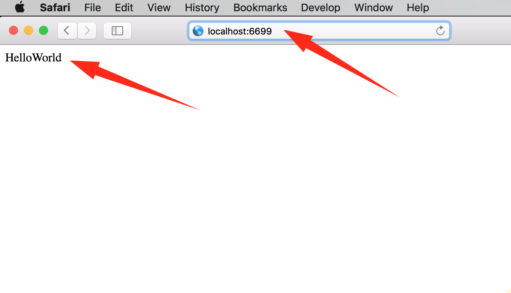

# HelloWorld

`HelloWorld` 是我们亘古不变的第一个入门程序。但是 `OpenResty` 不是一门编程语言，跟其他编程语言的 `HelloWorld` 不一样，让我们看看都有哪些不一样吧。

#### 创建工作目录

OpenResty 安装之后就有配置文件及相关的目录的，为了工作目录与安装目录互不干扰，并顺便学下简单的配置文件编写，我们另外创建一个 OpenResty 的工作目录来练习，并且另写一个配置文件。我选择在当前用户目录下创建 openresty-test 目录，并在该目录下创建 logs 和 conf 子目录分别用于存放日志和配置文件。

```shell
$ mkdir ~/openresty-test ~/openresty-test/logs/ ~/openresty-test/conf/
$
$ tree ~/openresty-test
/Users/yuansheng/openresty-test
├── conf
└── logs

2 directories, 0 files
```

#### 创建配置文件

在 conf 目录下创建一个文本文件作为配置文件，命名为 nginx.conf，文件内容如下:

```nginx
worker_processes  1;        #nginx worker 数量
error_log logs/error.log;   #指定错误日志文件路径
events {
    worker_connections 1024;
}

http {
    server {
		#监听端口，若你的6699端口已经被占用，则需要修改
        listen 6699;
        location / {
            default_type text/html;

            content_by_lua_block {
                ngx.say("HelloWorld")
            }
        }
    }
}
```

提示：如果你安装的是 openresty 1.9.3.1 及以下版本，请使用 `content_by_lua` 命令代替示例中的 `content_by_lua_block`。可使用 `nginx -V` 命令查看版本号。

#### 万事俱备只欠东风

我们启动 Nginx 即可，输入命令形式为：`nginx -p ~/openresty-test`，如果没有提示错误。如果提示 nginx 不存在，则需要在环境变量中加入安装路径，可以根据你的操作平台，参考前面的安装章节（一般需要重启生效）。

启动成功后，我们可以查看 nginx 进程是否存在，并通过访问 HTTP 页面查看应答内容。操作提示如下：

```shell
➜  ~ nginx -p ~/openresty-test
➜  ~ ps -ef | grep nginx
  501 88620     1   0 10:58AM ?? 0:00.00 nginx: master process nginx -p
                                    /Users/yuansheng/openresty-test
  501 88622 88620   0 10:58AM ?? 0:00.00 nginx: worker process
➜  ~ curl http://localhost:6699 -i
HTTP/1.1 200 OK
Server: openresty/1.9.7.3
Date: Sun, 20 Mar 2016 03:01:35 GMT
Content-Type: text/html
Transfer-Encoding: chunked
Connection: keep-alive

HelloWorld
```

在浏览器中完成同样的访问：


