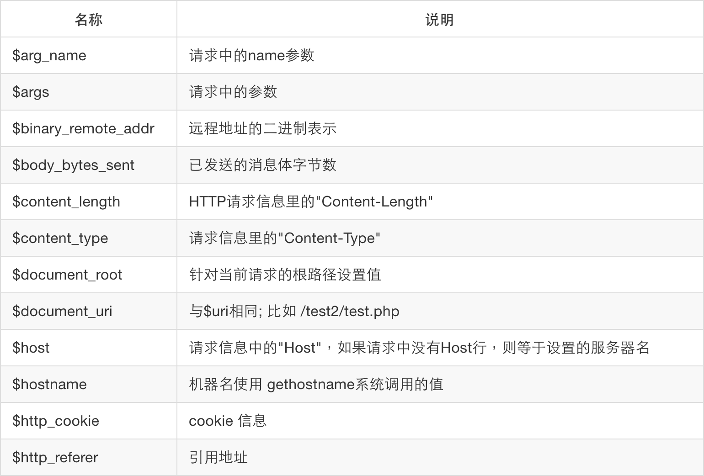
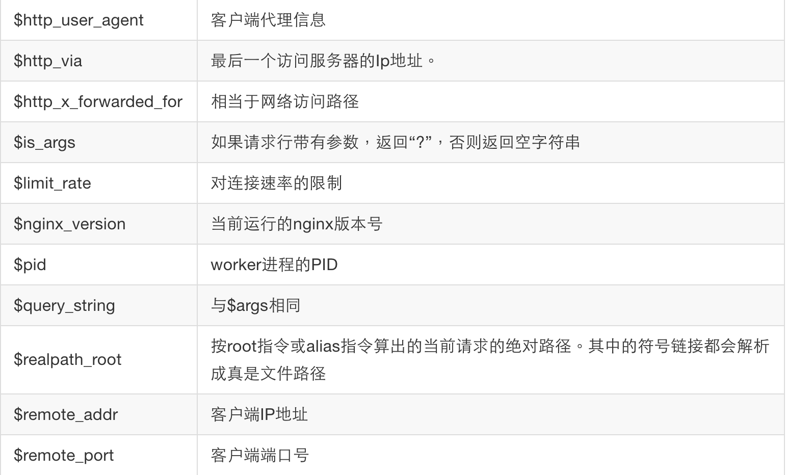
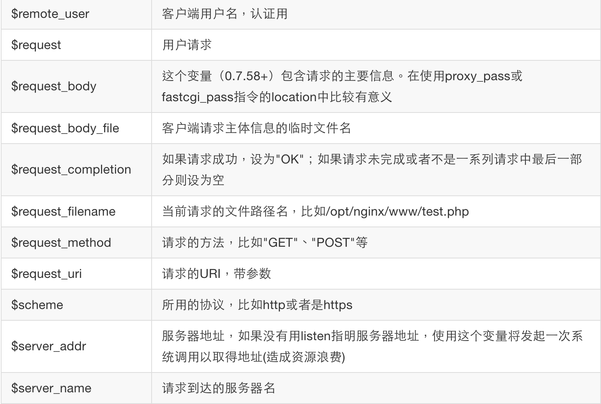
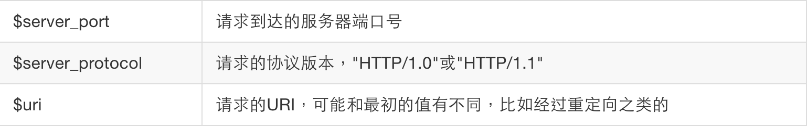

# 获取Nginx内置绑定变量

`Nginx`作为一个成熟、久经考验的负载均衡软件，与其提供丰富、完整的内置变量是分不开的，它极大增加了我们对`Nginx`网络行为的控制细度。这些变量大部分都是在请求进入时解析的，并把他们缓存到请求`cycle`中，方便下一次获取使用。首先我们来看看`Nginx`对我们都开放了那些`API`。

参看下表：






很多是吧，其实这还不是全部，`Nginx`一直在不停迭代更新是一个原因，还有一个原因是有些变量太冷门。使用它们，我们将会有很多玩法。

首先，我们在`OpenResty`中如何引用这些变量呢？参考[ngx.var.VARIABLE](https://github.com/openresty/lua-nginx-module#ngxvarvariable)小节。

利用这些内置变量，来做一个简单的数学求和运算例子：

```nginx
    server {
        listen    80;
        server_name  localhost;

        location /sum {
            #处理业务
           content_by_lua_block {
                local a = tonumber(ngx.var.arg_a) or 0
                local b = tonumber(ngx.var.arg_b) or 0
                ngx.say("sum:", a + b )
            }
        }
    }
```

验证一下：

```shell
➜  ~  curl 'http://127.0.0.1/sum?a=11&b=12'
sum:23
```

也许你笑了，这个`API`太简单了，貌似实际意义不大。我们做个最简易的防火墙，貌似有就那么点意思了不是？

代码如下：

```nginx
    server {
        listen    80;
        server_name  localhost;

        location /sum {
            # 使用access阶段完成准入阶段处理
            access_by_lua_block {
                local black_ips = {["127.0.0.1"]=true}

                local ip = ngx.var.remote_addr
                if true == black_ips[ip] then
                    ngx.exit(ngx.HTTP_FORBIDDEN)
                end
            };

            #处理业务
           content_by_lua_block {
                local a = tonumber(ngx.var.arg_a) or 0
                local b = tonumber(ngx.var.arg_b) or 0
                ngx.say("sum:", a + b )
            }
        }
    }
```

测试 shell ：

```shell
➜  ~  curl '192.168.1.104/sum?a=11&b=12'
sum:23
➜  ~
➜  ~
➜  ~  curl '127.0.0.1/sum?a=11&b=12'
<html>
<head><title>403 Forbidden</title></head>
<body bgcolor="white">
<center><h1>403 Forbidden</h1></center>
<hr><center>openresty/1.9.3.1</center>
</body>
</html>
```

通过测试结果看到，我们提取了终端的`IP`地址后进行限制，我们这个简单防火墙就诞生了。稍微扩充一下，就可以做到支持范围，如果再可以与系统`iptables`进行配合，那么达到软防火墙的目的就没有任何问题。

目前为止，我们所有的例子都是对`Nginx`内置变量的获取，我们是否可以对其进行设置呢？其实大多数内容都是不允许写入的，例如刚刚的终端`IP`地址，在应用中我们是不允许对其进行更新的。对于可写的变量中的`limit_rate`，是值得一提的，他能完成传输速率限制。进一步说对于静态文件传输、日志传输的情况，我们可以用它来完成限速的效果，它的影响是单个请求。

例如下面的例子：

```nginx
        location /download {
            access_by_lua_block {
                ngx.var.limit_rate = 1000
            };
        }
```

我们来下载这个文件：

```shell
➜  ~  wget '127.0.0.1/download/1.cab'
--2015-09-13 13:59:51--  http://127.0.0.1/download/1.cab
Connecting to 127.0.0.1... connected.
HTTP request sent, awaiting response... 200 OK
Length: 135802 (133K) [application/octet-stream]
Saving to: '1.cab'

1.cab                6%[===>             ]   8.00K  1.01KB/s   eta 1m 53s
```
