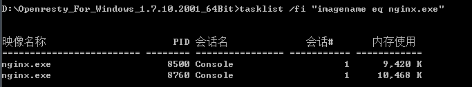
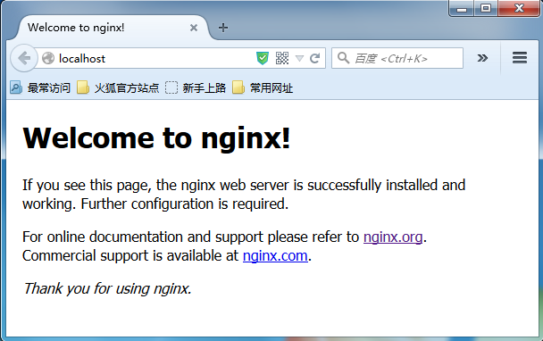

# Windows 平台安装

1、下载 Windows 版的 OpenResty 压缩包，这里我下载的是 openresty_for_windows_1.7.10.2001_64bit ，你也可以选择 32bit 的版本。如果你对源码感兴趣，下面是源码地址 [https://github.com/LomoX-Offical/nginx-openresty-windows](https://github.com/LomoX-Offical/nginx-openresty-windows)。

2、解压到要安装的目录，这里我选择D盘根目录，你可以根据自己的喜好选择位置。

3、进入到 openresty_for_windows_1.7.10.2001_64bit 目录，双击执行 nginx.exe 或者使用命令 start nginx 启动 nginx，如果没有错误现在 nginx 已经开始运行了。

4、验证 nginx 是否成功启动：

   * 使用 `tasklist /fi "imagename eq nginx.exe"` 命令查看 nginx 进程，其中一个是 master 进程，另一个是 worker 进程，如下图：

  

   * 在浏览器的地址栏输入 localhost，加载 nginx 的欢迎页面。成功加载说明 nginx 正在运行。如下图：

  

另外当 nginx 成功启动后，master 进程的 pid 存放在 `logs\nginx.pid` 文件中。

PS：OpenResty 当前也发布了 windows 版本，两个版本编译方式还是有区别的，这里更推荐这个版本。
