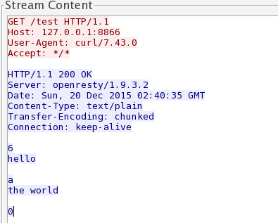

# 输出响应体

HTTP响应报文分为三个部分：

1. 响应行
1. 响应头
1. 响应体


对于 HTTP 响应体的输出，在 OpenResty 中调用 `ngx.say` 或 `ngx.print` 即可。经过查看官方 wiki ，这两者都是输出响应体，区别是 `ngx.say` 会对输出响应体多输出一个 `\n` 。如果你用的是浏览器完成的功能调试，使用这两着是没有区别的。但是如果我们使用各种终端工具，这时候使用 `ngx.say` 明显就更方便了。

### `ngx.say` 与 `ngx.print` 均为异步输出

首先需要明确一下的，是这两个函数都是异步输出的，也就是说当我们调用 `ngx.say` 后并不会立刻输出响应体。参考下面的例子：

```nginx
    server {
        listen       8866;

        location /test {
            content_by_lua_block {
                ngx.say("hello")
                ngx.sleep(3)
                ngx.say("the world")
            }
        }
    }
```

我们测试该接口可以观察到响应内容实在触发请求三秒后一起接收到响应体。

再看下面的例子：

```nginx
    server {
        listen       8866;
        lua_code_cache off;

        location /test {
            content_by_lua_block {
                ngx.say(string.rep("hello", 1000))
                ngx.sleep(3)
                ngx.say("the world")
            }
        }
    }
```

执行测试，我们可以发现首先收到了所有的 "hello" ，停顿大约 3 秒后，接着又收到了 "the world" 。

通过两个例子对比，我们可以知道，因为是异步输出，两个响应体的输出时机是 *不一样* 的。

### 如何优雅处理响应体过大的输出

如果响应体比较小，这时候相对就比较随意。但是如果响应体过大（例如超过 2G），是不能直接调用 API 完成响应体输出的。响应体过大，分两种情况：

1. 输出内容本身体积很大，例如超过 2G 的文件下载
1. 输出内容本身是由各种碎片拼凑的，碎片数量庞大，例如应答数据是某地区所有人的姓名

第①个情况，我们要利用 HTTP 1.1 特性 CHUNKED 编码来完成，我们一起来看看 CHUNKED 编码格式样例：



我们可以利用 CHUNKED 格式，把一个大的响应体拆分成多个小的应答体，分批、有节制的响应给请求方。

参考下面的例子：

```lua
location /test {
    content_by_lua_block {
        -- ngx.var.limit_rate = 1024*1024
        local file, err = io.open(ngx.config.prefix() .. "data.db","r")
        if not file then
            ngx.log(ngx.ERR, "open file error:", err)
            ngx.exit(ngx.HTTP_SERVICE_UNAVAILABLE)
        end

        local data
        while true do
            data = file:read(1024)
            if nil == data then
                break
            end
            ngx.print(data)
            ngx.flush(true)
        end
        file:close()
    }
}
```

按块读取本地文件内容（每次 1KB），并以流式方式进行响应。笔者本地文件 `data.db` 大小是 4G ， Nginx 服务可以稳定运行，并维持内存占用在 几MB 范畴。

注：其实 nginx 自带的静态文件解析能力已经非常好了。这里只是一个例子，实际中过大响应体都是后端服务生成的，为了演示环境相对封闭，所以这里选择本地文件。

第②个情况，其实我们就是要利用 `ngx.print` 的特性了，它的输入参数可以是单个或多个字符串参数，也可以是 table 对象。

参考官方示例代码：

```lua
local table = {
     "hello, ",
     {"world: ", true, " or ", false,
         {": ", nil}}
 }
 ngx.print(table)
```

将输出：

```lua
 hello, world: true or false: nil
```

也就是说当我们有非常多碎片数据时，没有必要一定连接成字符串后再进行输出。完全可以直接存放在 table 中，用数组的方式把这些碎片数据统一起来，直接调用 `ngx.print(table)` 即可。这种方式效率更高，并且更容易被优化。
