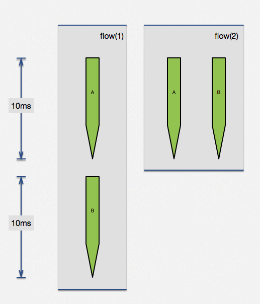
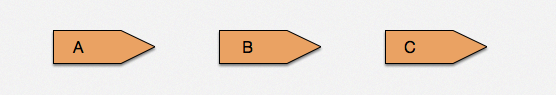

# 与其他 location 配合

nginx 世界的 location 是异常强大的，毕竟 nginx 的主要应用场景是在负载均衡、API server，在不同服务节点、location 之间跳转是家常便饭。利用不同 location 的功能组合，我们可以完成内部调用、流水线方式跳转、外部重定向等几大不同方式，下面将给大家介绍几个主要应用，就当抛砖引玉。

## 内部调用

例如对数据库、缓存的统一接口，我们是可以把它们放到统一的 location 中，外部可以通过 location 完成访问。通常情况下，为了保护这些内部接口，我们都会把这些接口设置为 internal 。我们可以用这个思路把不同基础方法作为内部接口，外部通过内部调用进行使用。基础模块、外部逻辑可以达到基本处理逻辑。

示例代码：

```nginx
location = /sum {
    # 只允许内部调用
    internal;

    # 这里做了一个求和运算只是一个例子，可以在这里完成一些数据库、
    # 缓存服务器的操作，达到基础模块和业务逻辑分离目的
    content_by_lua_block {
        local args = ngx.req.get_uri_args()
        ngx.say(tonumber(args.a) , tonumber(args.b))
    }
}

location = /app/test {
    content_by_lua_block {
        local res = ngx.location.capture(
                        "/sum", {args={a=3, b=8}}
                        )
        ngx.say("status:", res.status, " response:", res.body)
    }
}
```

紧接着，我们稍微扩充一下，就做到了并行请求的效果，看示例代码：

```nginx
location = /sum {
    internal;
    content_by_lua_block {
        local args = ngx.req.get_uri_args()
        ngx.print(tonumber(args.a) + tonumber(args.b))
    }
}

location = /subduction {
    internal;
    content_by_lua_block {
        local args = ngx.req.get_uri_args()
        ngx.print(tonumber(args.a) - tonumber(args.b))
    }
}

location = /app/test {
    content_by_lua_block {
        local res1, res2 = ngx.location.capture_multi( {
                        {"/sum", {args={a=3, b=8}}},
                        {"/subduction", {args={a=3, b=8}}}
                    })
        ngx.say("status:", res1.status, " response:", res1.body)
        ngx.say("status:", res2.status, " response:", res2.body)
    }
}
```

我们利用了 `ngx.location.capture_multi` 函数，直接完成了两个子请求并行执行的目的。尤其当两个请求没有相互依赖，用这种方法可以极大提高查询效率。例如两个无依赖查询请求，各自是10ms，顺序执行需要20ms，但是通过并行执行可以在10ms内完成两个请求。实际生产中查询时间可能没这么规整，但思想大同小异，这个特性还是很有用的。



该方法，可以被广泛应用于广告系统（1：N模型，一个请求，后端从N家供应商中获取条件最优广告）、高并发前端页面展示（并行无依赖界面、降级开关等）。

## 流水线方式跳转

现在的网络请求，已经变得越来越拥挤。各种不同 API 、下载请求混杂在一起，就要求不同厂商对下载的动态调整有各种不同的定制策略，而这些策略在一天的不同时间段，规则可能还不一样。这时候我们还可以效仿工厂的流水线模式，逐层过滤、处理。

示例代码：

```nginx
location ~ ^/static/([-_a-zA-Z0-9/]+).jpg {
    set $image_name $1;
    content_by_lua '
        ngx.exec("/download_internal/images/" 
                .. ngx.var.image_name .. ".jpg");
    ';
}

location /download_internal {
    # 这里还可以有其他统一的 download 下载设置，例如限速等
    alias ../download;
}
```

注意，ngx.exec 方法与 ngx.redirect 是完全不同的，前者是个纯粹的内部跳转并且没有引入任何额外 HTTP 信号。 这里的两个 location 更像是流水线上工人之间的协作关系。第一环节的工人对完成自己处理部分后，直接交给第二环节处理人（实际上可以有更多环节）。他们之间的数据流是定向流动的。



## 外部重定向

不知道大家什么时候开始注意的，百度的首页已经不再是 HTTP 协议，它已经全面修改到了 HTTPS 协议上。但是对于大家的输入习惯，估计还是在地址栏里面输入 `baidu.com` ，回车后发现它会自动跳转到 `https://www.baidu.com` ，这时候就需要的外部重定向了。

```nginx
location = /foo {
    content_by_lua_block {
        ngx.say([[i'm foo]])
    }
}

location = /app/test {
    rewrite_by_lua_block {
        return ngx.redirect('/foo');  
    }
}
```

我们来使用 curl 工具发个测试用例，可以发现：

```shell
➜  ~  curl 127.0.0.1:8866/app/test -i
HTTP/1.1 302 Moved Temporarily
Server: openresty/1.9.3.2rc3
Date: Sun, 22 Nov 2015 11:04:03 GMT
Content-Type: text/html
Content-Length: 169
Connection: keep-alive
Location: /foo

<html>
<head><title>302 Found</title></head>
<body bgcolor="white">
<center><h1>302 Found</h1></center>
<hr><center>openresty/1.9.3.2rc3</center>
</body>
</html>
➜  ~  curl 127.0.0.1:8866/foo -i
HTTP/1.1 200 OK
Server: openresty/1.9.3.2rc3
Date: Sun, 22 Nov 2015 10:43:51 GMT
Content-Type: text/html
Transfer-Encoding: chunked
Connection: keep-alive

i'm foo
```

当我们使用浏览器访问页面 `http://127.0.0.1:8866/app/test` 就可以发现浏览器会自动跳转到 `http://127.0.0.1:8866/foo` 。

与之前两个应用实例不同的，外部重定向是可以跨域名的。例如从 A 网站跳转到 B 网站是绝对允许的。在 CDN 场景的大量下载应用中，一般分为调度、存储两个重要环节。调度就是通过根据请求方 IP 、下载文件等信息寻找最近、最快节点，应答跳转给请求方完成下载。
