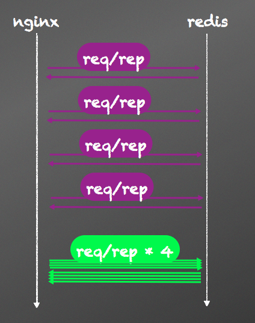

# pipeline压缩请求数量

通常情况下，我们每个操作redis的命令都以一个TCP请求发送给redis，这样的做法简单直观。然后，当我们有连续多个命令需要发送给redis时，如果每个命令都以一个数据包发送给redis，将会降低服务端的并发能力。

为什么呢？大家知道每发送一个TCP报文，会存在网络延时及操作系统的处理延时。大部分情况下，网络延时要远大于CPU的处理延时。如果一个简单的命令就以一个TCP报文发出，网络延时将成为系统性能瓶颈，使得服务端的并发数量上不去。

首先检查你的代码，是否明确完整使用了redis的长连接机制。作为一个服务端程序员，要对长连接的使用有一定了解，在条件允许的情况下，一定要开启长连接。验证方式也比较简单，直接用tcpdump或wireshark抓包分析一下网络数据即可。

> set_keepalive的参数：按照业务正常运转的并发数量设置，不建议使用峰值情况设置。

如果我们确定开启了长连接，发现这时候Redis的CPU的占用率还是不高，在这种情况下，就要从Redis的使用方法上进行优化。

如果我们可以把所有单次请求，压缩到一起，如下图：


很庆幸Redis早就为我们准备好了这道菜，就等着我们吃了，这道菜就叫`pipeline`。pipeline机制将多个命令汇聚到一个请求中，可以有效减少请求数量，减少网络延时。下面是对比使用pipeline的一个例子：

```
# you do not need the following line if you are using
    # the ngx_openresty bundle:
    lua_package_path "/path/to/lua-resty-redis/lib/?.lua;;";

    server {
        location /withoutpipeline {
            content_by_lua '
                local redis = require "resty.redis"
                local red = redis:new()

                red:set_timeout(1000) -- 1 sec

                -- or connect to a unix domain socket file listened
                -- by a redis server:
                --     local ok, err = red:connect("unix:/path/to/redis.sock")

                local ok, err = red:connect("127.0.0.1", 6379)
                if not ok then
                    ngx.say("failed to connect: ", err)
                    return
                end

                local ok, err = red:set("cat", "Marry")
                ngx.say("set result: ", ok)
                local res, err = red:get("cat")
                ngx.say("cat: ", res)

                ok, err = red:set("horse", "Bob")
                ngx.say("set result: ", ok)
                res, err = red:get("horse")
                ngx.say("horse: ", res)


                -- put it into the connection pool of size 100,
                -- with 10 seconds max idle time
                local ok, err = red:set_keepalive(10000, 100)
                if not ok then
                    ngx.say("failed to set keepalive: ", err)
                    return
                end
            ';
        }

        location /withpipeline {
            content_by_lua '
                local redis = require "resty.redis"
                local red = redis:new()

                red:set_timeout(1000) -- 1 sec

                -- or connect to a unix domain socket file listened
                -- by a redis server:
                --     local ok, err = red:connect("unix:/path/to/redis.sock")

                local ok, err = red:connect("127.0.0.1", 6379)
                if not ok then
                    ngx.say("failed to connect: ", err)
                    return
                end

                red:init_pipeline()
                red:set("cat", "Marry")
                red:set("horse", "Bob")
                red:get("cat")
                red:get("horse")
                local results, err = red:commit_pipeline()
                if not results then
                    ngx.say("failed to commit the pipelined requests: ", err)
                    return
                end

                for i, res in ipairs(results) do
                    if type(res) == "table" then
                        if not res[1] then
                            ngx.say("failed to run command ", i, ": ", res[2])
                        else
                            -- process the table value
                        end
                    else
                        -- process the scalar value
                    end
                end

                -- put it into the connection pool of size 100,
                -- with 10 seconds max idle time
                local ok, err = red:set_keepalive(10000, 100)
                if not ok then
                    ngx.say("failed to set keepalive: ", err)
                    return
                end
            ';
        }
    }
```

在我们实际应用场景中，正确使用pipeline对性能的提升十分明显。我们曾经某个后台应用，逐个处理大约100万条记录需要几十分钟，经过pileline压缩请求数量后，最后时间缩小到20秒左右。做之前能预计提升性能，但是没想到提升如此巨大。

在360企业安全目前的应用中，Redis的使用瓶颈依然停留在网络上，不得不承认Redis的处理效率相当赞。

