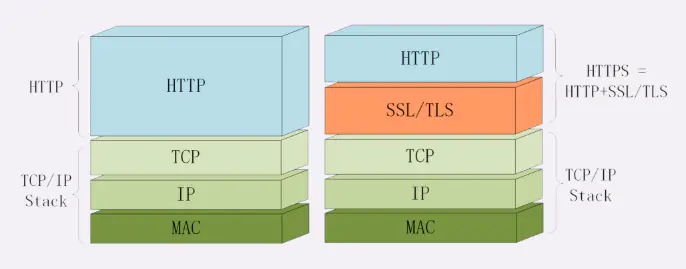
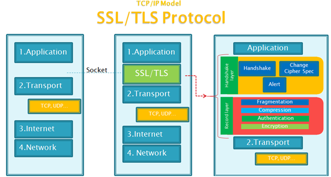

# HTTPS 时代

来自互联网上各方的推动，正在让 HTTPS 快速普及起来。如今 HTTPS 的概念已经深入开发者的日常，成为每个 Web developer 不得不做的功课之一。

HTTPS = HTTP + SSL/TLS（图片来自 [通俗易懂的HTTPS握手过程](https://juejin.im/post/6845166891737022471)）

在这个 HTTPS 时代，OpenResty 可以帮助我们实现什么? 接下来的几节，讨论的正是如何结合 OpenResty，开发出易于拓展的 HTTPS 应用。

> 注：本章的内容要求使用 OpenResty 而非 lua-nginx-module，因为这部分功能会依赖于 OpenResty 维护的 Nginx/OpenSSL patch。
>
> 另外，虽然标题用的是 SSL（Secure Sockets Layer 安全套接层），但是我们讨论的更多是 TLS（Transport Layer Security，传输层安全协议）。沿用 SSL 这个旧名，主要是出于命名上的习惯。

（图片来自 [SSL与TLS的区别以及介绍](https://www.cnblogs.com/susanhonly/p/7489532.html)）

（图片仅供建立初步印象或知识回顾，想更深入了解 HTTPS 相关知识，请参考专门的学习资料。）
