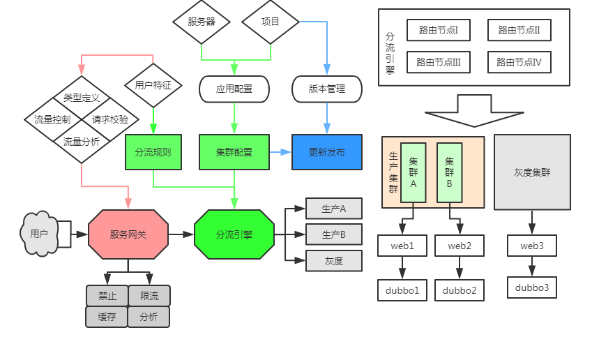

# 灰度发布

对于灰度发布，这里主要讲解如何实现，我所在的公司虽然是使用这个逻辑实现的，但是由于掺杂了太多业务相关东西，比如抓包、限流、缓存、校验、SSO (Single Sign On)、云化、监控告警，已经成为了一个运维平台。
导致无法开源，真是好可惜。做这个系统多年还是想让大家来找找茬刷刷存在感的。

我想当前没有一个开源的，可能也和这个原因有关：太多功能和业务相关难以抽离成纯粹组件开源。

下面先讲主要逻辑结构，请看下图：

这里需要讲解一下下面几个名词的含义，方便后续理解。聪明的读者们估计看完这些名词概念应该就理解了灰度是如何实现的。

### 分流引擎：
采用 OpenResty 实现的可完全动态分发目标集群的 Nginx 集合，称为 **分流引擎**。
这是一个 **逻辑概念**，是所有 Nginx 的集合。

因为我们的规则是要同步到里面所有 Nginx，所以概念上他们是一个集群部署的集合。
请看逻辑结构示意图的右上角。

### 生产集群/灰度集群：
这里把公司整个系统在内部逻辑上切割成多个集群进行 **垂直部署**。物理上可以任意方式部署出来。

但是逻辑上他们需要相互独立，不会互相影响，标准为：我们可以关闭其中某个集群任意服务器而不影响其他集群。

另外，这里为什么需要生产集群 A，生产集群 B 呢，是为了实现 **无损发布**，在发布过程中我们相互使用对方来承载用户访问。 **但是逻辑上他们都是生产集群**。

而 **灰度集群** 只有一个，在部署上也可以一切从简，是因为我们设计上他们是可以有损更新的，毕竟目标用户只有我们自己人。

### 用户特征/分流规则：
**用户特征** 其实就是 **判断条件** 的一个叫法，比如我们说"host 为 xxx 的分发到灰度集群"，
那么这个 host 就叫用户特征，整条语句就叫 **分流规则**。

这里的判断条件是需要支持逻辑条件判断的，比如 **或者**，**并且**什么的。这样才方便组合出灵活好用的匹配目标用户的分流规则。

### 服务网关
这里我虽然也叫 **服务网关**，在概念上和服务网关意义差别也不是特别大。
统称为所有请求前置的一些校验、判断、分析的逻辑，但是玩法可以非常丰富有趣。

比如，动态的配置某种后端响应缓存，在这里是非常奇妙的一种设计。
再比如，服务端特定请求抓包，放在这里真是太有意思了。
