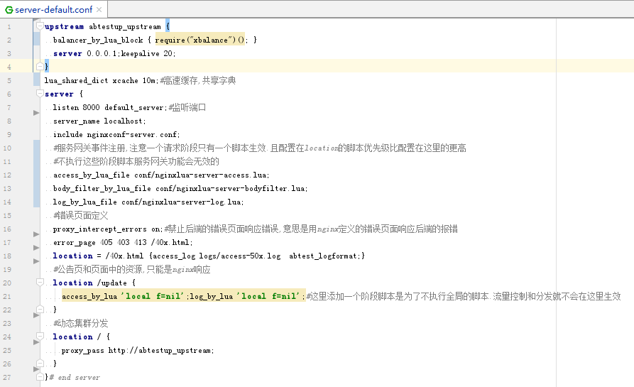

# 分流引擎设计

分流引擎是整个系统的最核心,所有功能实现都依托于这个分流引擎,所以设计上是重中之重这个系统是否好用的关键因素在这里.

我在设计的时候其实看过几个别人做出来的系统,参考了优缺的.

##设计目标:
###1.完全独立
只有完全独立,无第三方依赖的程序才具备高健壮性.除非代码有bug,否则绝不会因为其他因素而带来故障.

事实上正是这点为我避规了非常多风险,我想你们应该知道这个分流引擎(nginx)是真正面对一线用户的东西,如果健壮性有问题会多么可怕.
完全独立这个目标也包括可以不依赖控制台独立存在.

当然为了这个目标也需要做到很多额外的设计要求,比如共享内存持久化,需要开发一套分流引擎的接口,和一套控制台的接口,完成数据交互对接

###2.完全分布式,性能可线性扩容
在设计上,所有功能第一考虑要素是需要支持分布式.

比如限流,我们可以使用redis进行全局精确限流,但是违背了设计目标1,目标2的可线性扩容也不容易做到.

所以我在设计上采用nginx共享内存进行限流,用控制台对限流值按权重赋值给每一个nginx.这样的非精确限流
事实上这样设计才是合理的,因为前端组件不应该做这种业务级别判断,绝对一致的精确限流应该是后端做的.比如库存扣减.

我们nginx这里只保证放到后端的请求是后端可以承受的,但不保证这一秒放过的请求和下一秒完全一样.

###3.配置动态化
最初春哥的lua模块是不支持balancer_by_lua阶段的,
所以一开始我是采用access_by_lua阶段判断分发的目标集群保存在一个nginx变量里,然后集群发生改变更新集群配置reload的

我们知道nginx的reload是有短暂的并发低谷的,所以发现支持balancer_by_lua阶段后我第一时间修改逻辑为所有集群配置和分流规则放共享内存.

结合我前面提到的制作一个共享内存持久化的库就可以保证配置动态,但是又独立存在,以后开发的其他功能也可以复用这个设计模式


最终一个server段的配置就这么简单了,其他配置都是固定不变无需调整.
但是在功能开发上需要尽量pcall执行代码不要在非关键错误上使nginx报500



其实如果你只要简单实现动态分发,只要学习下balancer_by_lua这个阶段代码的示例怎么写就可以了.还是非常简单的

在分发判断逻辑上还是需要好好思考的,要足够灵活又要配置简单,还要执行效率高.

我这里采用的配置结构为.
```lua
{
{
其他的一些配置项,比如分发目标集群编号,超时时间设置
['or]={{条件1},{条件2}}
['and]={{条件1},{条件2}}
},
{第二个分流规则}
}
```
相同的判断条件是有执行缓存的,其实说到这里,可以得出一个程序界的终极法则,想要快就要多用缓存,多传址少copy


