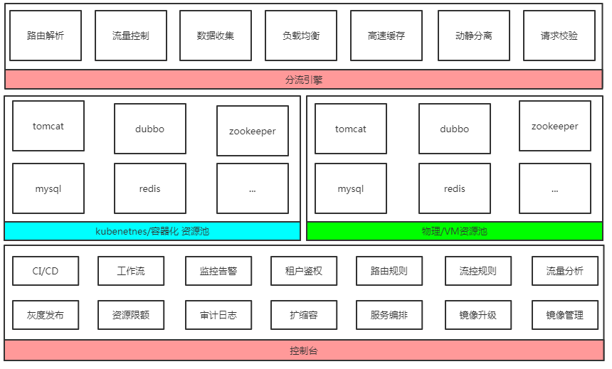

# 控制台开发

一般一个复杂些的软件都需要配套一个web控制台,方便人类进行配置和管理.

一个web控制台的开发说容易也很容易,说复杂也很复杂,主要是看想做成什么样子.简单有简单做法复杂有复杂做法,

我这里主要讲讲我的控制台是怎么做出来的,不讲细节了.

这里先展示下功能架构是如何的

##技术选型
为了统一技术栈,我并没有选择java而是同样使用openresty+mysql+redis的结构.
目前redis并不放太多数据,只放一些临时使用的需要持久化的数据,比如session,监控告警当前值.

###web页面渲染
由于几千前vue类的前端并不流行,我选择了使用resty.template做后端渲染

###后端框架
找了找后端框架相对有名成熟的是lor所以就使用了.另外添加了点模块,比如权限校验,请求参数校验

###webssh
目前使用的是gotty做能力实现,权限校验在openresty进行拦截判断

###更新发布
最初我使用的是ssh完成应用更新的,后来发现ansible更加的简便好用,也就使用ansible来做更新发布了.

这里需要着重介绍的是,更新过程是需要先更新分发规则到不更新的集群中,然后执行更新和回退的.最后也要用自动化手段验证这个集群更新是否成功

这块后面讲

###工作流
工作流其实就是一个todo list顺序执行,主要在于配置好先后关系,依赖关系,顺序执行下去,减少人工操作带来的不确定.和脚本差不多样子.

###k8s
使用k8s对系统进行云化,特别是内部私有云真的的是很简单方便.这里不得不安利一下了..

因为不适用分布式文件系统的情况下,一切都那么的简单明了.学习下网络模型,api接口,k8s的原理概念就好

###其他
其实一个控制台做起来是非常耗时的,一点界面调整,样式调整都要反复修改,或者接口修改.

考虑怎么展现比较合理又易用是要很多思考..

我这里由于是多年前的后端渲染模型,所以相对简单点,页面主要部分使用一个div.

get后端渲染后的html页面插入这个div里面就完成主要界面展现了,虽然也在考虑使用vue实现,但是前端改变有点太大了不太划算

更多其他什么的也不知道描述什么了.有想我写的联系我后面补充吧

