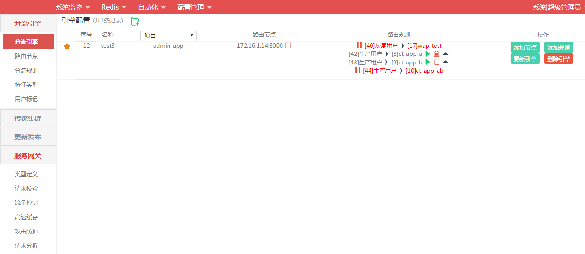
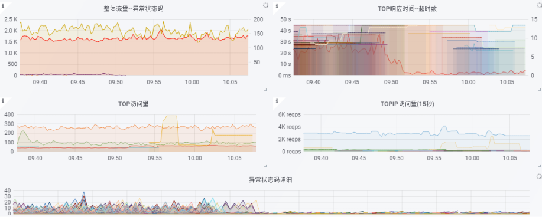
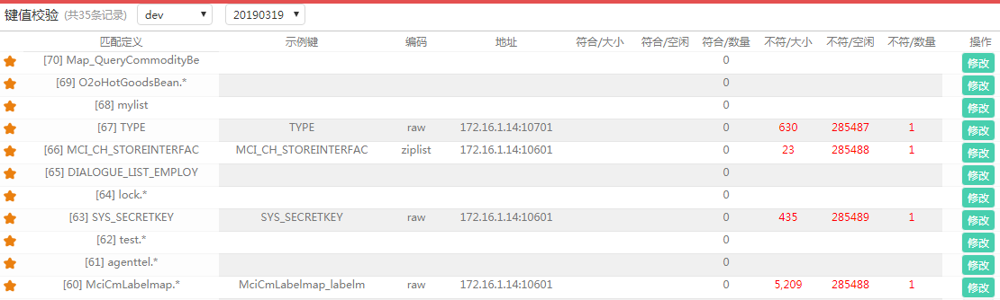

# 向运维平台发展

这个发展方向是正在和实际需求进行结合的,这里有这个篇章只是为以后做的铺垫.并不是说我已经作完了.

先简单展示下主界面吧,界面风格仅仅是个人爱好紧凑型的,没有专门ui设计的.

##系统监控
目前使用prometheus+grafana实现的,只是像应用发现,服务器发现,使用的是prometheus调控制台的接口去发现的,

另外告警也是先发送达到控制台产生告警事件,控制台配置告警事件具体的告警后续处理的.

目前还没有太多使用监控的数据,来源实际需求驱动,这里只是为了可以查看到系统状态.

##redis
相信运维过大一些redis集群的人呢都会有痛点的.
这里做了集群状态展示,高耗指令查看,键值校验.

关键要讲的其实就是这个键值校验了,可以每天使用从节点对集群内数据进行合法性匹配,自动删除不符合要求的数据,

当然所有自动都要合理使用,误删了可就麻烦了..

##自动化
自动化板块主要是和自动化测试进行集成执行,不一定要自己实现自动化,这里主要为了执行方便.

可以采用嵌入某个自动化系统的ui,也可以写个执行入口放界面上点击和查看执行结果.关键是为了验证更新结果是否正确

