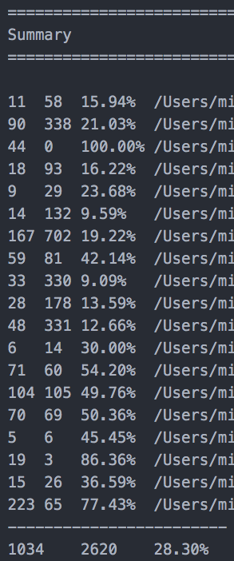

# 代码覆盖率
这是一个重要的可量化指标，如果代码覆盖率很高，你就可以放心的修改代码，在发版本的时候也能睡个安稳觉。否则就是拆东墙补西墙，陷入无尽的 bug 诅咒中。

那么在 OpenResty 里面如何看到代码覆盖率呢？其实很简单，使用 [LuaCov](https://keplerproject.github.io/luacov/) 可以很方便的实现。

我们先了解下 LuaCov，这是一个针对 Lua 脚本的代码覆盖率工具，通过 luarocks 来安装：
```
luarocks install luacov
```

当然，你也可以通过 [github 上的源码](https://github.com/keplerproject/luacov) 编译来安装。这个方式你可以修改 LuaCov 的一些默认配置。

比如 LuaCov 的分析文件是按照 100 条一批来写入的，如果你的代码量不大，可能就会不准确。你可以修改 /src/luacov/defaults.lua 里面的 savestepsize，改为 2，来适应你的应用场景。

在 OPenResty 里面使用 LuaCov，只用在 nginx.conf 中增加  init_by_lua_block（只能放在 http 上下文中） 既可。
```
init_by_lua_block {
    require 'luacov.tick'
    jit.off()
}
```
这个 \*_bolck 语法在较新的 OpenResty 版本中新引入，如果提示指令不存在，请使用最新的来版本来测试。

重新启动 OpenResty 后，LuaCov 就已经生效了。你可以跑下单元测试，或者访问下 API 接口，在当前工作目录下，就会生成 `luacov.stats.out` 这个统计文件。然后 cd 到这个目录下，运行：
```
luacov
```
就会生成 `luacov.report.out` 这个可读性比较好的覆盖率报告。需要注意的是，luacov 这个命令后面不用加任何的参数，这个在官方文档里面有说明，只是比较隐晦。

我们看下 `luacov.report.out` 里面的一个片段：
```
1	function get_config(mid, args)
13	  local configs = {}
13	  local res, err = red:hmget("client_".. mid, "tpl_id", "gid")
13	  if err then
****0     return nil, err
        end
      end
```
代码前面的数字，代表的是运行的次数。而 `****0` 很明确的指出这行代码没有被测试案例覆盖到。

在 `luacov.report.out` 的最后会有一个汇总的覆盖率报告：



可以看到，在我的这个单元测试里面，一共涉及到近 20 个代码文件。其中倒数第三个是我测试的 API 接口， 覆盖到的代码有 19 行，没有覆盖的有 3 行，所以代码覆盖率是 86.36% （19.0 / (19 + 3)）。

最后有一个总的代码覆盖率是 28.3%，这个值在跑完所有单元测试后是有意义的，单跑一个是没有参考价值的，因为很多基础函数可能并没有运行到。
