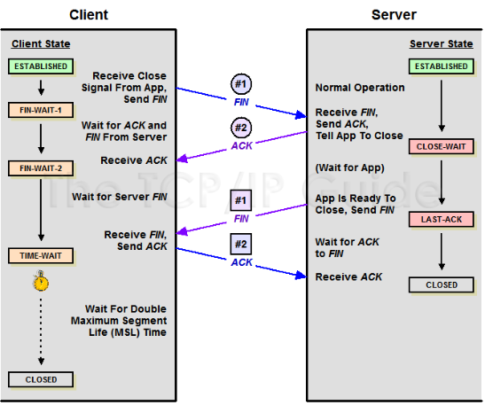

# TIME_WAIT

这个是高并发服务端常见的一个问题，一般的做法是修改 sysctl 的参数来解决。
但是，做为一个有追求的程序猿，你需要多问几个为什么，为什么会出现 TIME_WAIT？出现这个合理吗？

我们需要先回顾下 tcp 的知识，请看下面的状态转换图（图片来自[「 The TCP/IP Guide 」](http://www.tcpipguide.com/)）：



因为 TCP 连接是双向的，所以在关闭连接的时候，两个方向各自都需要关闭。
先发 FIN 包的一方执行的是主动关闭；后发 FIN 包的一方执行的是被动关闭。
***主动关闭的一方会进入 TIME_WAIT 状态，并且在此状态停留两倍的 MSL 时长。***

修改 sysctl 的参数，只是控制 TIME_WAIT 的数量。你需要很明确的知道，在你的应用场景里面，你预期是服务端还是客户端来主动关闭连接的。一般来说，都是客户端来主动关闭的。

Nginx 在某些情况下，会主动关闭客户端的请求，这个时候，返回值的 connection 为 close。我们看两个例子：

#### HTTP 1.0 协议

请求包：

```
GET /hello HTTP/1.0
User-Agent: curl/7.37.1
Host: 127.0.0.1
Accept: */*
Accept-Encoding: deflate, gzip

```

应答包：

```
HTTP/1.1 200 OK
Date: Wed, 08 Jul 2015 02:53:54 GMT
Content-Type: text/plain
Connection: close

hello world
```
对于 HTTP 1.0 协议，如果请求头里面没有包含 connection，那么应答默认是返回 Connection: close，
也就是说 Nginx 会主动关闭连接。

#### user agent
请求包：

```
POST /api/heartbeat.json HTTP/1.1

Content-Type: application/x-www-form-urlencoded
Cache-Control: no-cache
User-Agent: Mozilla/4.0 (compatible; MSIE 6.0; Windows NT)
Accept-Encoding: gzip, deflate
Accept: */*
Connection: Keep-Alive
Content-Length: 0
```

应答包：

```
HTTP/1.1 200 OK
Date: Mon, 06 Jul 2015 09:35:34 GMT
Content-Type: text/plain
Transfer-Encoding: chunked
Connection: close
Content-Encoding: gzip
```
这个请求包是 HTTP 1.1 的协议，也声明了 Connection: Keep-Alive，为什么还会被 Nginx 主动关闭呢？
***问题出在 User-Agent***，Nginx 认为终端的浏览器版本太低，不支持 keep alive，所以直接 close 了。

在我们应用的场景下，终端不是通过浏览器而是后台请求的，
而我们也没法控制终端的 User-Agent，那有什么方法不让 Nginx 主动去关闭连接呢？
可以用[keepalive_disable](http://nginx.org/en/docs/http/ngx_http_core_module.html#keepalive_disable)这个参数来解决。这个参数并不是字面的意思，用来关闭 keepalive，
而是用来定义哪些古代的浏览器不支持 keepalive 的，默认值是 MSIE6。

```
keepalive_disable none;
```
修改为 none，就是认为不再通过 User-Agent 中的浏览器信息，来决定是否 keepalive。


注：本文内容参考了[火丁笔记](http://huoding.com/2013/12/31/316)和[Nginx 开发从入门到精通](http://tengine.taobao.org/book/chapter_02.html)，感谢大牛的分享。
